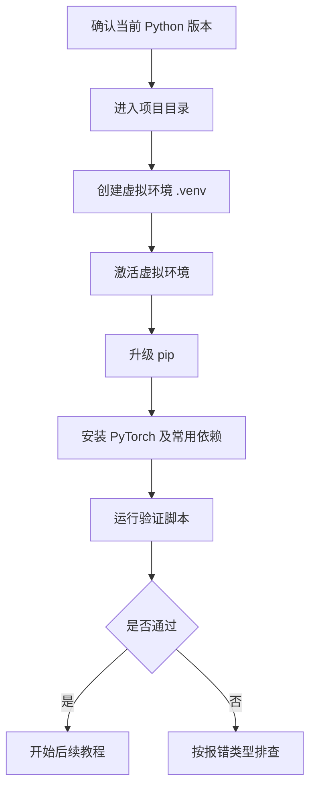

# EP01｜环境准备与安装验证


作者：吴佳浩

撰稿时间：2026-06-03

## 本篇你会学到什么

学完这一篇，你应该能够：

- 在 Windows 本地正确准备 PyTorch 学习环境
- 理解为什么要先统一 Python、pip、虚拟环境和项目目录
- 根据自己的机器情况判断应该先走 CPU 还是 GPU 路线
- 用一段最小验证脚本确认 `torch`、`torchvision`、`torchaudio` 是否安装成功
- 排查最常见的环境问题，比如解释器选错、虚拟环境没激活、CUDA 不可用等

---

## 一、为什么第一篇不是写模型，而是先配环境

很多人学 PyTorch 卡住，不是因为不会写神经网络，而是因为环境从第一天就没统一。

最常见的情况有这些：

- 电脑里装了多个 Python，但自己不知道当前终端到底在用哪个
- `pip install` 装到了全局环境，运行代码时却用了另一个解释器
- 编辑器里选的是系统 Python，命令行里激活的却是 `.venv`
- 明明机器有 NVIDIA 显卡，却不知道到底该先装 CPU 版还是 CUDA 版
- 代码文件、数据文件、模型权重文件散落在不同目录，后面一运行就报路径错误

所以这一步不是“杂活”，而是后面整套教程能不能顺利推进的前提。

你可以把这一篇理解成：

> 先把地基打平，后面 14 篇才不会边学边修环境。

---

## 二、先建立一个正确的学习原则

在正式动手前，我建议你先接受一个很现实的原则：

### 原则 1：先跑通，再优化

不要一上来就执着于“我必须 GPU”“我必须 CUDA 版本最完美”“我必须装成生产环境那样”。

对于初学者来说，更合理的路径是：

1. 先把 Python + 虚拟环境 + PyTorch 跑起来
2. 先确认最小示例能执行
3. 再考虑 GPU、混合精度、训练加速这些进阶问题

如果你一开始就把时间都花在 CUDA 兼容、驱动版本、显卡架构支持上，学习节奏很容易被打断。

### 原则 2：一个项目一个虚拟环境

不要把深度学习依赖全装到系统全局环境里。

原因很简单：

- PyTorch 版本更新很快
- torchvision、torchaudio 与 torch 存在版本匹配关系
- 不同项目可能依赖不同版本的 Python 或第三方库

所以更稳的做法是：

> 每个项目目录单独配一个 `.venv`，把环境和代码绑在一起。

### 原则 3：环境是否合格，不看“安装过程”，看“验证结果”

很多人看到终端里安装日志滚过去，就以为已经成功了。

真正应该看的不是安装过程，而是下面这几个问题：

- 能不能 `import torch`
- 能不能打印版本号
- 能不能创建 Tensor 并做一次简单计算
- 如果你走 GPU 路线，`torch.cuda.is_available()` 到底是不是 `True`

只有这些验证通过，环境才算真的就绪。

---

## 三、真实学习场景里，环境为什么会反复出问题

### 场景 1：命令行能跑，VS Code 里不能跑

这是最常见的问题之一。

原因通常不是 PyTorch 坏了，而是：

- 你在 PowerShell 里激活了 `.venv`
- 但 VS Code 选中的解释器不是这个虚拟环境

于是你会看到很典型的报错：

```python
ModuleNotFoundError: No module named 'torch'
```

这不一定说明没安装，而是说明**你运行代码的解释器和你安装依赖的解释器不是同一个**。

### 场景 2：机器有显卡，但 CUDA 还是 False

这也很常见。

可能原因包括：

- 装的是 CPU 版 PyTorch
- NVIDIA 驱动没有正确安装
- CUDA 运行时版本和当前 PyTorch 构建不匹配
- 显卡太新，当前 PyTorch 版本还不支持该算力架构

所以“有显卡”不等于“PyTorch 一定能直接识别 GPU”。

### 场景 3：项目后面越写越乱

初学者一开始如果没有统一目录，后面就容易出现：

- 训练数据放桌面
- 脚本放下载目录
- 模型权重放其他盘
- 输出图表又保存在临时目录

结果不是学不会，而是每次运行前都在找文件。

所以这一篇除了安装依赖，还要顺手把目录结构统一掉。

---

## 四、推荐的项目目录结构

在这一整套教程里，我们统一使用当前仓库目录：

```text
G:\openclaw\docs\PyTorch-教程
```

建议保持下面这套基础结构：

```text
PyTorch-教程/
├── .venv/                 # 虚拟环境
├── data/                  # 数据集或示例数据
├── outputs/               # 图片、日志、可视化结果
├── runs/                  # 训练过程输出
├── checkpoints/           # 模型权重和断点
├── project_demo/          # 仓库里的 demo
├── PyTorch 系列教程_EP01_环境准备与安装验证.md
├── ...
└── PyTorch 系列教程_README.md
```

下面这段命令可以先把常用目录建出来：

```powershell
cd G:\openclaw\docs\PyTorch-教程
mkdir data, outputs, runs, checkpoints
```

### 为什么要提前分目录

因为后面你会逐渐遇到这些文件：

- 原始数据
- 处理后的缓存数据
- 模型保存文件 `.pt` / `.pth`
- 训练日志
- loss / accuracy 曲线图
- 推理输出结果

如果这些东西都堆在项目根目录里，教程越往后就越乱。

---

## 五、环境准备流程总览（Mermaid）

先看一眼完整流程，后面每一步就不会迷路。



这张图的重点不是“步骤很多”，而是提醒你：

> 配环境不是一条命令的事，而是一整套闭环：创建、安装、验证、排查。

---

## 六、正式开始：确认 Python 与 pip

### 1. 查看当前 Python 版本

先打开 PowerShell，执行：

```powershell
python --version
```

建议使用 Python 3.10、3.11 或 3.12 这一类主流版本。太老的版本后面很多库支持会变差，太新的版本有时又会遇到生态兼容问题。

### 2. 确认当前 Python 来自哪里

这一步非常重要。

```powershell
where python
```

你要关注的是：

- 当前终端实际调用的是哪个 `python.exe`
- 它是不是你预期中的安装路径

如果这里已经显示出多个 Python 路径，不要慌，但你至少要知道自己后面到底在用哪个。

### 3. 顺手看一下 pip 指向谁

```powershell
python -m pip --version
```

为什么我推荐用 `python -m pip` 而不是直接用 `pip`？

因为这样可以更明确地保证：

- 你调用的 pip 属于当前这个 Python
- 不容易出现“装到 A，运行用 B”的错位情况

---

## 七、创建并激活虚拟环境

### 1. 进入项目目录

```powershell
cd G:\openclaw\docs\PyTorch-教程
```

### 2. 创建虚拟环境

```powershell
python -m venv .venv
```

这条命令会在当前目录下生成一个 `.venv` 文件夹，用来隔离这个项目自己的依赖环境。

### 3. 激活虚拟环境

```powershell
.\.venv\Scripts\activate
```

激活成功后，你通常会在终端左边看到类似这样的前缀：

```powershell
(.venv) PS G:\openclaw\docs\PyTorch-教程>
```

这表示你后面的 `python` 和 `pip` 已经优先指向这个虚拟环境。

### 4. 升级 pip

```powershell
python -m pip install --upgrade pip
```

这一步虽然简单，但很值得做。因为老版本 pip 可能在解析依赖、下载 wheel 包时遇到不必要的问题。

---

## 八、安装 PyTorch 与常用依赖

### 方案 A：先走 CPU 路线（更稳）

如果你是初学者，或者只是想先把教程顺利跑起来，我建议优先用这条路线。

```powershell
python -m pip install torch torchvision torchaudio matplotlib pandas scikit-learn jupyter
```

这套依赖足够覆盖本系列教程里大多数基础实验。

### 方案 B：明确要走 GPU 路线

如果你已经确认：

- 自己机器有 NVIDIA GPU
- 驱动正常
- 你确实希望后面训练用 GPU 加速

那就去 PyTorch 官网获取当前推荐的安装命令，而不是凭印象手敲。

原因很简单：

- 不同版本 torch 对应不同构建
- CUDA 版本不是“越新越好”，而是“与当前构建匹配最好”
- Windows 环境下，官方命令通常最稳

### 一个很实际的建议

如果你不确定自己该装什么，就先装 CPU 版，把前几篇教程学完。等你真的进入训练实战、图像任务、加速优化阶段，再回来切 GPU 路线，成本反而更低。

---

## 九、写一个最小验证脚本

下面这段代码的目标很简单：

- 确认 `torch` 能导入
- 打印版本信息
- 检查 CUDA 是否可用
- 创建一个 Tensor 做一次简单计算

这不是演示深度学习，而是在验证“环境是否真的活着”。

```python
import torch

# 打印当前 torch 版本
# 这一行最先确认：你至少已经成功安装并导入了 PyTorch
print("torch 版本:", torch.__version__)

# 检查当前是否能使用 CUDA
# 如果返回 False，不一定是错，很多学习场景用 CPU 也完全可以继续
print("CUDA 可用:", torch.cuda.is_available())

# 如果 CUDA 可用，就进一步打印显卡名称和 CUDA 构建版本
if torch.cuda.is_available():
    print("GPU 名称:", torch.cuda.get_device_name(0))
    print("CUDA 版本:", torch.version.cuda)
else:
    print("当前使用 CPU，前几篇教程也能正常学习。")

# 创建两个最简单的一维张量
# 这一步是在验证张量运算是否正常，不只是 import 成功而已
x = torch.tensor([1.0, 2.0, 3.0])
y = torch.tensor([4.0, 5.0, 6.0])

# 做一次逐元素加法
# 如果这里能正常输出结果，说明基础计算环境已经没问题了
z = x + y
print("x + y =", z)

# 再打印张量的 dtype 和 device，帮助你建立最早期的 Tensor 直觉
print("z.dtype =", z.dtype)
print("z.device =", z.device)
```

---

## 十、运行结果应该怎么看

如果一切正常，你大概会看到类似输出：

```text
torch 版本: 2.x.x
CUDA 可用: False
当前使用 CPU，前几篇教程也能正常学习。
x + y = tensor([5., 7., 9.])
z.dtype = torch.float32
z.device = cpu
```

如果你走的是 GPU 路线，可能会看到：

```text
torch 版本: 2.x.x+cuxxx
CUDA 可用: True
GPU 名称: NVIDIA GeForce RTX xxxx
CUDA 版本: 12.x
x + y = tensor([5., 7., 9.])
z.dtype = torch.float32
z.device = cpu
```

这里有两个容易忽略的点：

### 1. `CUDA 可用: False` 不等于失败

这通常只说明：

- 你当前装的是 CPU 版
- 或者 GPU 还没被当前环境识别

对前期学习来说，这并不构成阻塞。

### 2. 即使机器支持 GPU，默认新建 Tensor 也可能还在 CPU

比如上面代码里的 `z.device = cpu` 很正常，因为我们并没有主动把数据迁移到 GPU。

真正放到 GPU 上，通常要显式写：

```python
device = "cuda" if torch.cuda.is_available() else "cpu"
x = x.to(device)
y = y.to(device)
```

这个概念我们后面章节会反复用到。

---

## 十一、在 VS Code 里应该额外检查什么

如果你用 VS Code 学习，除了命令行成功，还要检查编辑器这一步。

### 1. 解释器是否选中了 `.venv`

通常在 VS Code 右下角可以看到当前 Python 解释器。

你要确保它指向的是类似下面的路径：

```text
G:\openclaw\docs\PyTorch-教程\.venv\Scripts\python.exe
```

### 2. 终端是否激活了同一个环境

有时候解释器选对了，但终端没切对；也有时候终端对了，解释器没切对。

只有这两者一致，你的体验才会稳定。

### 3. 不要被“代码补全正常”骗了

有时编辑器能补全，不代表运行时就一定没问题。最终还是要以“能否成功运行验证脚本”为准。

---

## 十二、常见错误与排查

### 问题 1：`python` 不是你想要的版本

先执行：

```powershell
where python
python --version
```

如果你发现路径不对，说明当前终端优先使用了另一个 Python。这个时候先别急着装库，先把解释器问题搞清楚。

### 问题 2：安装后还是提示 `No module named torch`

最常见原因有两个：

- 当前终端没有激活 `.venv`
- 编辑器运行时使用的不是这个虚拟环境

先重新执行：

```powershell
.\.venv\Scripts\activate
python -m pip --version
python -c "import torch; print(torch.__version__)"
```

如果命令行能成功而编辑器不行，基本就是解释器选择问题。

### 问题 3：`torch.cuda.is_available()` 是 False

先不要直接判定“安装失败”。更合理的排查顺序是：

1. 你是不是装了 CPU 版 PyTorch
2. 你的显卡是不是 NVIDIA
3. 驱动是否正常
4. 当前 PyTorch 构建是否支持你的显卡架构

对于学习阶段，我的建议依旧是：

> 先用 CPU 跑通教程，再决定要不要折腾 GPU。

### 问题 4：PowerShell 里无法激活虚拟环境

有些机器会因为执行策略限制，导致脚本无法直接运行。

这时不要第一反应就怀疑 PyTorch，问题往往只是 PowerShell 的执行策略或终端权限。

如果你遇到这种情况，可以：

- 先确认是不是 PowerShell 限制脚本执行
- 或者临时改用 CMD 测试虚拟环境是否能正常激活

核心目标不是“必须用某个终端”，而是把环境先跑通。

### 问题 5：装得很乱，不知道当前环境到底有没有救

如果你已经在全局环境、多个 Python、多个 pip 之间来回折腾过，最省时间的办法往往不是继续补救，而是：

1. 回到项目目录
2. 删除当前 `.venv`
3. 重新创建一个新的虚拟环境
4. 重新安装依赖
5. 再跑验证脚本

很多环境问题不是技术难，而是历史包袱太多。

---

## 十三、本篇小结

这一篇最核心的结论只有三点：

1. **先把环境统一好，再学 PyTorch，效率会高很多**
2. **一个项目一个虚拟环境，是最省事的长期做法**
3. **环境是否合格，不看安装日志，看验证脚本是否跑通**

如果你现在已经能做到下面这几件事，就说明 EP01 过关了：

- 知道自己当前用的是哪个 Python
- 能在项目目录创建并激活 `.venv`
- 能安装 `torch` 并成功导入
- 能运行验证脚本并看懂输出
- 知道自己当前是 CPU 路线还是 GPU 路线

---

## 十四、练习题

### 练习 1
在你的终端里执行：

```powershell
where python
python --version
python -m pip --version
```

把这三条命令的输出各自代表什么，自己用一句话解释出来。

### 练习 2
删除项目中的 `.venv` 后，重新创建一次虚拟环境，并重新安装 `torch`。目标是把“环境搭建”从照抄命令变成你自己能独立完成的动作。

### 练习 3
修改验证脚本，在输出 `torch.__version__` 之外，再打印：

- `torch.rand(2, 3)` 的结果
- 这个张量的 `shape`
- 这个张量的 `dtype`
- 这个张量的 `device`

让自己开始熟悉 Tensor 的几个核心属性。

### 练习 4
如果你的机器有 NVIDIA 显卡，尝试查清楚下面 3 个信息：

- 显卡型号是什么
- 当前驱动是否正常
- 你当前安装的 PyTorch 是 CPU 版还是 CUDA 版

先把事实确认清楚，不要凭感觉判断。

---

## 下一篇预告

下一篇我们正式进入 PyTorch 的核心基础：**Tensor 与张量基本操作**。

你会看到：

- Tensor 为什么是整个 PyTorch 世界的基础数据结构
- `shape`、`dtype`、`device` 到底分别在管什么
- 为什么很多初学者的第一批报错，其实都和 Tensor 理解不清有关
