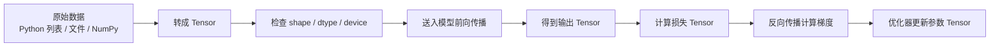

# EP02｜Tensor 与张量基本操作


作者：吴佳浩

撰稿时间：2026-06-03

## 本篇你会学到什么

学完这一篇，你应该能够：

- 理解 Tensor 为什么是 PyTorch 的核心数据结构
- 分清 `shape`、`dtype`、`device` 这三个最常见也最容易混淆的概念
- 掌握张量的创建、变形、索引、切片、基础计算和设备迁移
- 看懂训练代码里 Tensor 是如何在“数据 → 模型 → 损失”之间流动的
- 遇到 shape 不匹配、CPU/GPU 不一致、整型与浮点型混用等问题时知道怎么排查

---

## 一、为什么要先学 Tensor

如果把 PyTorch 看成一个深度学习工具箱，那么 **Tensor（张量）就是这个工具箱里最核心的容器**。

你后面会接触到的几乎所有内容，都离不开 Tensor：

- 数据集里的样本，最终通常会被转成 Tensor
- 模型里的参数，本质上也是 Tensor
- 损失函数的输出，是 Tensor
- 反向传播时计算出来的梯度，仍然是 Tensor

也就是说，在 PyTorch 里，**数据、参数、结果、梯度，本质上都围绕 Tensor 运转**。

如果你对 Tensor 的 `shape`、`dtype`、`device` 不熟，后面写模型时就会经常遇到这些错误：

- `mat1 and mat2 shapes cannot be multiplied`
- `expected scalar type Float but found Long`
- `Expected all tensors to be on the same device`

所以这一篇虽然是基础篇，但它其实决定了你后面很多章节学得顺不顺。

---

## 二、核心理论讲解

### 1. Tensor 到底是什么

可以先把 Tensor 理解成：

> **一个带有深度学习属性的多维数组。**

如果你学过 NumPy，可以把 Tensor 想成“增强版 ndarray”。它和普通数组相比，多了几类深度学习特别关心的信息：

- **shape**：张量的维度结构
- **dtype**：张量中元素的数据类型
- **device**：张量存放在 CPU 还是 GPU
- **grad 信息**：它是否参与梯度计算，以及梯度值是什么

这也是为什么 PyTorch 不直接用 Python 列表来训练模型。因为列表虽然能装数字，但它没有这些对训练来说很关键的属性。

### 2. 什么是 shape

`shape` 表示张量每个维度的大小。

比如：

- `torch.tensor([1, 2, 3])` 的 shape 是 `(3,)`
- `torch.tensor([[1, 2], [3, 4]])` 的 shape 是 `(2, 2)`
- 一批图片如果是 32 张、每张图片 3 个通道、大小 224 × 224，那常见 shape 是 `(32, 3, 224, 224)`

你可以把 shape 理解成“数据排布方式”。模型之所以会报 shape 错误，往往不是数据值错了，而是**模型期待的数据排布方式**和你给它的实际排布方式不一致。

### 3. 什么是 dtype

`dtype` 表示元素类型，比如：

- `torch.int64`
- `torch.float32`
- `torch.float64`
- `torch.bool`

为什么它重要？因为不同运算对类型有要求。

例如：

- 神经网络参数通常是 `float32`
- 分类标签常常是 `int64`（尤其是配合 `CrossEntropyLoss` 时）
- 掩码数据可能是 `bool`

很多初学者的错误并不是逻辑错，而是 `dtype` 不符合损失函数或运算要求。

### 4. 什么是 device

`device` 表示张量当前在哪个设备上：

- `cpu`
- `cuda:0`
- `cuda:1`

为什么它重要？因为 PyTorch 要求参与同一次计算的张量通常在同一设备上。

比如模型在 GPU 上，而输入数据还在 CPU 上，就会报错。这个问题在训练阶段非常常见。

### 5. Tensor 为什么是统一数据结构

PyTorch 的一个设计优势是：**尽量用同一种数据结构贯穿训练全流程。**

从数据输入到模型输出，再到梯度计算，尽量都围绕 Tensor 展开。这样做的好处是：

- API 更统一
- 设备迁移更自然
- 自动求导更容易挂接
- 训练和推理的代码风格更一致

这也是为什么你后面写 `Dataset`、`DataLoader`、`nn.Module`、`loss.backward()` 时，会不断看到 Tensor。

---

## 三、先建立一个直觉理解

你可以把 Tensor 想成一个“会跟着训练流程移动和变化的智能数据盒子”。

它不只是装数字，还带着这些说明书：

- 我现在是什么形状
- 我里面存的是整数还是浮点数
- 我现在在 CPU 还是 GPU
- 我需不需要记录梯度

这个“数据盒子”会在训练流程中不断变化：

1. 原始数据先被整理成 Tensor
2. Tensor 被送进模型
3. 模型输出新的 Tensor
4. 损失函数再生成一个表示误差的 Tensor
5. 反向传播通过 Tensor 之间的计算图回传梯度

所以学 Tensor，不是单纯学一个数据结构，而是在学 **PyTorch 整个数据流的基础语言**。

---

## 四、真实项目里怎么用

### 场景 1：表格数据训练分类模型

假设你有一份用户行为数据，每条样本有 10 个特征：

- 年龄
- 点击次数
- 停留时间
- 购买次数
- ……

当你把这些数据喂给全连接网络时，它们通常会变成一个二维 Tensor：

- shape 可能是 `(batch_size, 10)`

这里：

- 行代表样本数
- 列代表特征数

### 场景 2：图片分类

假设你在做猫狗分类。

原始图片经过预处理后，会变成四维 Tensor：

- `(batch_size, channels, height, width)`

例如：

- `(32, 3, 224, 224)`

如果你把维度搞错成 `(32, 224, 224, 3)`，很多 PyTorch 模型就会直接报错，因为它们默认期待的是“通道在前”的格式。

### 场景 3：把训练搬到 GPU

真实训练时，你往往会把：

- 输入数据 `x`
- 标签 `y`
- 模型 `model`

都迁移到同一个 `device` 上。否则前向传播就会失败。

所以你会经常看到下面这种代码：

```python
x = x.to(device)
y = y.to(device)
model = model.to(device)
```

这就是 Tensor 的 `device` 属性在真实工程里的体现。

---

## 五、流程图 / 结构图（Mermaid）

下面这张图展示了 Tensor 在一个最基本训练流程中的位置：



这张图想说明的重点是：

- Tensor 不是只在某一步用一下
- 它贯穿训练全流程
- 你对 Tensor 的理解程度，直接决定你后面写训练代码时出错的频率

---

## 六、从零写一个最小可运行示例

下面这段代码会演示：

- 如何创建 Tensor
- 如何查看 `shape`、`dtype`、`device`
- 如何做变形操作
- 如何做基础计算
- 如何做索引和切片
- 如何迁移到 GPU（如果机器支持）

```python
import torch

# 1. 创建一个二维张量
# 这里的数据会被自动推断成整数类型，通常是 int64
x = torch.tensor([[1, 2, 3], [4, 5, 6]])

print("原始张量 x:")
print(x)
print("x.shape =", x.shape)
print("x.dtype =", x.dtype)
print("x.device =", x.device)

print("-" * 50)

# 2. 创建浮点张量
# 神经网络里的输入、参数和大多数计算更常见的是 float32
x_float = torch.tensor([[1, 2, 3], [4, 5, 6]], dtype=torch.float32)
print("浮点张量 x_float:")
print(x_float)
print("x_float.dtype =", x_float.dtype)

print("-" * 50)

# 3. 几种常见创建方式
zeros = torch.zeros(2, 3)      # 全 0 张量，常用于初始化
ones = torch.ones(2, 3)        # 全 1 张量，常用于测试
randn = torch.randn(2, 3)      # 标准正态分布随机数
arange = torch.arange(0, 12)   # 生成 0 到 11

print("zeros =\n", zeros)
print("ones =\n", ones)
print("randn =\n", randn)
print("arange =\n", arange)

print("-" * 50)

# 4. 形状变换
# 把一维张量 reshape 成 3 行 4 列
x2 = arange.reshape(3, 4)
print("x2 =\n", x2)
print("x2.shape =", x2.shape)

# 在第 0 维新增一个维度，常用于给单样本补 batch 维
x3 = x2.unsqueeze(0)
print("x3.shape =", x3.shape)

# 再把大小为 1 的维度压掉
x4 = x3.squeeze(0)
print("x4.shape =", x4.shape)

print("-" * 50)

# 5. 基础计算
# 深度学习里大量操作本质上都是张量的逐元素计算或矩阵运算
a = torch.tensor([1.0, 2.0, 3.0])
b = torch.tensor([4.0, 5.0, 6.0])

print("a + b =", a + b)
print("a - b =", a - b)
print("a * b =", a * b)
print("a / b =", a / b)
print("torch.sum(a) =", torch.sum(a))
print("torch.mean(a) =", torch.mean(a))

print("-" * 50)

# 6. 索引与切片
# 训练中经常会用来取某一行、某一列或某个子区域
x5 = torch.arange(12).reshape(3, 4)
print("x5 =\n", x5)
print("第 0 行 =", x5[0])
print("第 1 列 =", x5[:, 1])
print("右下角子矩阵 =\n", x5[1:, 2:])

print("-" * 50)

# 7. 迁移到设备
# 如果当前机器支持 CUDA，就把张量迁移到 GPU；否则留在 CPU
device = "cuda" if torch.cuda.is_available() else "cpu"
x_device = x_float.to(device)
print("当前选择的 device =", device)
print("x_device.device =", x_device.device)
```

---

## 七、拆解代码执行过程

我们把上面的代码按学习重点再拆一遍。

### 1. 创建 Tensor 时，先关注默认类型

```python
x = torch.tensor([[1, 2, 3], [4, 5, 6]])
```

这里你没有手动指定 `dtype`，PyTorch 会根据数据自动推断。因为这里全是整数，所以常见结果会是 `int64`。

这件事很重要，因为后面如果你把这个张量直接送进很多神经网络层或损失函数，可能就会出现类型不匹配。

### 2. `shape` 决定了数据怎么排布

```python
print(x.shape)
```

输出会类似：

```python
torch.Size([2, 3])
```

它表示：

- 这个张量有 2 行
- 每行有 3 个元素

你要逐渐形成一个习惯：

> 看张量时，先看形状，再看数值。

因为很多训练问题根本不是“数值错”，而是“形状错”。

### 3. `reshape`、`unsqueeze`、`squeeze` 是最常用的形状调整工具

- `reshape()`：重新安排张量形状
- `unsqueeze()`：增加一个长度为 1 的维度
- `squeeze()`：去掉长度为 1 的维度

这些操作在训练里非常常见，因为：

- 模型输入经常要求特定形状
- DataLoader 返回的 batch 与单样本形状不同
- 图像、文本、表格数据的组织方式都不同

### 4. 切片操作是理解 batch 数据的基础

```python
x5[:, 1]
```

这里表示“取所有行的第 1 列”。

这种语法你后面会频繁用在：

- 拆输入与标签
- 选取部分特征
- 处理多维数据子区域

### 5. `to(device)` 是训练迁移到 GPU 的入口动作

```python
x_device = x_float.to(device)
```

这一步的核心不是“炫技”，而是让你开始形成设备一致性的意识。

后面一旦训练上 GPU，通常都要保证：

- 模型在 GPU
- 输入数据在 GPU
- 标签也在 GPU（或至少在运算所需设备上）

否则就会出现经典报错：

```python
Expected all tensors to be on the same device
```

---

## 八、再看一个更贴近训练的例子

上面的代码偏“语法级演示”，下面我们再看一个更贴近真实训练场景的小例子。

目标：模拟一个 batch 的输入特征，并做一次线性层前向计算。

```python
import torch
import torch.nn as nn

# 假设这里有一个 batch，共 4 条样本，每条样本 3 个特征
# 这类形状在表格数据、小型分类任务里很常见
batch_x = torch.tensor([
    [0.5, 1.2, -0.3],
    [1.0, 0.7,  0.8],
    [-0.6, 0.1, 1.5],
    [0.2, -1.1, 0.4]
], dtype=torch.float32)

# 定义一个最简单的线性层：输入维度 3，输出维度 2
# 你可以把它理解成“把 3 维特征映射到 2 维输出空间”
layer = nn.Linear(in_features=3, out_features=2)

# 前向传播
# 输出的 shape 会从 (4, 3) 变成 (4, 2)
out = layer(batch_x)

print("batch_x.shape =", batch_x.shape)
print("out.shape =", out.shape)
print("out =\n", out)
```

### 这段代码要观察什么

重点看两个 shape：

- 输入 `batch_x.shape = (4, 3)`
- 输出 `out.shape = (4, 2)`

这说明线性层没有改变 batch 大小，只是把每条样本的特征维从 3 映射到了 2。

这就是 Tensor 在模型中流动时最常见的行为：

> batch 维通常保留，特征维按网络结构变化。

---

## 九、运行结果应该怎么看

如果你的环境正常，上面的代码通常都会输出这些信息：

- 张量内容
- `shape`
- `dtype`
- `device`
- 形状变化前后结果
- 基础运算结果
- 线性层输出结果

你真正要学会看的，不只是“打印成功了没”，而是：

### 1. 先看 shape

这是后续 80% 调试问题的源头。

### 2. 再看 dtype

尤其是：

- 输入是不是 `float32`
- 标签是不是 `int64`

### 3. 最后看 device

只要一上 GPU，就要开始有设备一致性的习惯。

---

## 十、常见错误与排查

### 问题 1：`expected scalar type Float but found Long`

这通常表示你把整数张量拿去做需要浮点输入的运算了。

解决思路：

```python
x = x.float()
```

或者在创建时直接指定：

```python
x = torch.tensor(data, dtype=torch.float32)
```

### 问题 2：`mat1 and mat2 shapes cannot be multiplied`

这是最经典的 shape 错误之一。

本质是：

- 你输入给线性层或矩阵乘法的数据形状不对
- 模型期待的最后一维和你实际给的不匹配

排查时第一步不要瞎改层数，先打印：

```python
print(x.shape)
```

### 问题 3：`Expected all tensors to be on the same device`

这说明参与同一次计算的张量不在同一设备上。

常见情况是：

- 模型已经 `.to("cuda")`
- 输入张量还在 CPU

解决思路是统一迁移：

```python
x = x.to(device)
model = model.to(device)
```

### 问题 4：`mean()` 报类型相关错误

有些统计运算更适合浮点型张量。如果张量是整型，有时你会遇到行为不符合预期或结果类型不合适的问题。

稳妥做法是先转成浮点型：

```python
x = x.float()
```

### 问题 5：`reshape` 后结果看不懂

初学者常常把 `reshape` 当成“随便换个样子”，但本质上它是在重新组织同一批数据。

你要始终记住：

- 元素总数必须一致
- 改的是排列方式，不是数据本身

---

## 十一、本篇小结

这一篇最重要的结论有四个：

1. **Tensor 是 PyTorch 训练全流程里的基础数据结构**
2. **看张量先看 `shape`，再看 `dtype`，再看 `device`**
3. **很多初学者报错不是因为模型太难，而是因为 Tensor 没理清**
4. **一旦进入训练，Tensor 不再只是“装数字”，而是整个数据流的核心载体**

如果你现在已经能做到下面这些事，就说明这一篇掌握得不错：

- 能创建不同类型的 Tensor
- 能看懂并打印 `shape`、`dtype`、`device`
- 能使用 `reshape`、`unsqueeze`、`squeeze`
- 能做简单索引、切片和基础运算
- 知道 CPU / GPU 张量迁移的基本方式

---

## 十二、练习题

### 练习 1
创建一个 shape 为 `(2, 3)` 的浮点张量，并打印它的：

- `shape`
- `dtype`
- `device`

### 练习 2
创建一个一维张量 `torch.arange(12)`，把它分别变形成：

- `(3, 4)`
- `(2, 6)`
- `(1, 3, 4)`

观察这些变形前后，元素总数是否保持不变。

### 练习 3
自己写一段代码，演示下面三种切片：

- 取第一行
- 取最后一列
- 取右下角 2×2 子矩阵

### 练习 4
定义一个 `nn.Linear(3, 2)`，再创建一个 shape 为 `(5, 3)` 的输入张量，观察输出张量的 shape 是多少，并解释为什么。

### 练习 5
如果你的机器支持 CUDA，尝试把一个浮点张量迁移到 GPU，再打印它的 `device`；如果不支持，也请打印当前自动选择到的设备，并解释原因。

---

## 下一篇预告

下一篇我们会进入一个真正把 PyTorch 和“会学习”这件事连接起来的主题：**自动求导与反向传播**。

到那时你会看到：

- Tensor 为什么不仅能存数据，还能参与梯度计算
- `requires_grad=True` 到底意味着什么
- `loss.backward()` 背后到底在发生什么
