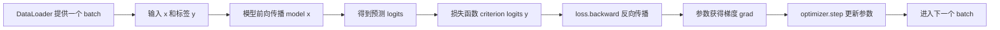

# EP06｜完整训练循环实战


作者：吴佳浩

撰稿时间：2026-06-03

## 本篇你会学到什么

这一篇承接前面的模型、梯度与数据管道，第一次把它们真正接成一个可以训练的闭环。学完这一篇，你应该能够：

- 理解一个完整训练循环到底由哪些部分组成
- 知道前向传播、损失计算、反向传播、参数更新之间的关系
- 能独立写出一个最小但真实可运行的训练脚本
- 学会从 loss、shape、device、梯度更新等角度判断训练有没有写崩
- 为后面的分类任务、CNN、迁移学习和项目模板打下基础

---

## 一、为什么要学完整训练循环

很多人学 PyTorch 时会出现一个典型问题：

- 看模型定义能看懂
- 看 Dataset/DataLoader 也大概懂
- 但一到“把这些东西串起来训练”，就开始混乱

因为真正让模型“学起来”的，不是某个孤立 API，而是 **完整训练循环（training loop）**。

你可以把训练循环理解成深度学习训练的主发动机。它会反复做这几件事：

1. 从数据集中取一个 batch
2. 把 batch 喂给模型做前向传播
3. 根据预测结果和真实标签计算损失
4. 通过反向传播计算梯度
5. 用优化器更新模型参数
6. 重复以上过程，直到模型逐渐学到规律

如果你不会写训练循环，那前面学的模型、损失函数、优化器、DataLoader 都只是零件，还没有真正组装成能运行的系统。

---

## 二、核心理论讲解

### 1. 训练循环的四件套

一个最小可运行训练过程，通常离不开四个核心组件：

- **模型 `model`**：定义输入如何变成输出
- **损失函数 `criterion`**：衡量预测和真实标签差多远
- **优化器 `optimizer`**：根据梯度更新模型参数
- **数据加载器 `loader`**：按 batch 提供训练数据

这四个组件缺一不可。

### 2. 前向传播在做什么

前向传播（forward）就是：

> 把输入数据送进模型，得到预测结果。

例如分类任务里：

- 输入 `x` 是特征向量
- 模型输出 `logits`
- `logits` 表示模型对各类别的原始打分

注意：很多分类模型的输出不是最终类别，而是每个类别的得分。真正的损失函数和后续预测逻辑，会基于这些得分继续处理。

### 3. 损失函数在做什么

损失函数（loss function）是训练是否有效的度量器。

它回答的问题是：

> 模型当前的预测，离真实答案有多远？

例如：

- 回归任务常用 `MSELoss`
- 多分类任务常用 `CrossEntropyLoss`

损失越大，通常说明模型当前预测越差；损失逐步下降，通常说明训练在起作用。

### 4. 反向传播在做什么

反向传播（backward）不是“把模型倒着跑一遍”，而是：

> 根据损失，计算每个可学习参数应该朝哪个方向调整，以及调整幅度大概多大。

这些结果会以梯度的形式保存在模型参数的 `.grad` 中。

### 5. 优化器在做什么

优化器（optimizer）负责真正更新参数。

比如最经典的梯度下降思路是：

- 如果某个参数往大了调会让 loss 更高，那就往小了调
- 如果某个参数往小了调会让 loss 更高，那就往大了调

在代码层面上，优化器常见顺序是：

```python
optimizer.zero_grad()
loss.backward()
optimizer.step()
```

这三行几乎是训练循环的核心骨架。

### 6. 为什么每个 batch 都要 `zero_grad`

这是非常重要的一个细节。

在 PyTorch 里，梯度默认是**累加**的，而不是每次自动清空。

这意味着如果你不手动清空梯度：

- 当前 batch 的梯度会叠加到上一个 batch 上
- 参数更新就会混入旧梯度
- 训练结果往往会异常

所以大多数基础训练脚本里，都会在每轮 batch 更新前调用：

```python
optimizer.zero_grad()
```

---

## 三、先建立一个直觉理解

你可以把完整训练循环想成一个“老师批改作业并纠正学生”的过程：

1. 学生先作答（模型前向传播）
2. 老师对答案（损失函数计算误差）
3. 老师指出哪里错、错多少（反向传播计算梯度）
4. 学生根据反馈改进（优化器更新参数）
5. 下一轮继续做题

训练进行很多轮之后，模型就会逐渐从“完全不会”变成“有一定规律可循”。

这个比喻虽然不严谨，但非常适合理解训练循环的本质：

- **前向传播**：先给答案
- **损失函数**：评估答案
- **反向传播**：生成纠错信息
- **优化器**：执行修正

---

## 四、真实项目里怎么用

### 场景 1：二分类风控模型

假设你有一份用户特征表，每条样本 10 个特征，标签是 0/1，表示“是否高风险用户”。

真实项目中你通常会：

- 用 `Dataset` 封装样本和标签
- 用 `DataLoader` 按 batch 读取
- 用一个小型多层感知机做分类
- 用 `CrossEntropyLoss` 计算分类误差
- 用 `Adam` 优化模型参数

这就是完整训练循环的典型落地方式。

### 场景 2：图像分类训练

在图片任务里，你的训练循环逻辑几乎不变，只是：

- 输入 Tensor 的 shape 从 `(batch, feature_dim)` 变成 `(batch, channels, height, width)`
- 模型从线性层变成 CNN
- 数据预处理更复杂

但训练循环本身依然是：

- 取数据
- 前向传播
- 算损失
- 反向传播
- 更新参数

这说明训练循环是**跨任务通用的骨架能力**。

---

## 五、流程图 / 结构图（Mermaid）

下面这张图展示了训练循环中各组件之间的关系：



这张图有两个你必须记住的重点：

1. `loss.backward()` 负责“算出怎么改”
2. `optimizer.step()` 负责“真的去改”

很多新手以为调用了 `backward()` 参数就自动更新了，这是不对的。

---

## 六、从零写一个最小可运行示例

下面我们写一个完整但尽量简洁的训练脚本。

这个例子不是伪代码，而是一个本地可运行的最小分类训练案例。它用随机生成的数据模拟一个二分类任务，重点不是追求高精度，而是让你看清楚训练循环每一步到底在做什么。

```python
import torch
import torch.nn as nn
from torch.utils.data import Dataset, DataLoader


class ToyDataset(Dataset):
    """
    一个最小可运行的数据集示例。

    这里我们用随机特征 + 随机标签来模拟二分类任务。
    真实项目里，这里通常会改成：
    - 从 CSV 读取数据
    - 从图片目录读取图像
    - 从数据库或缓存中加载样本
    """
    def __init__(self, num_samples=200, num_features=10, num_classes=2):
        # 随机生成输入特征
        # shape: (样本数, 特征数)
        # 这里使用 float32，符合大多数神经网络输入要求
        self.x = torch.randn(num_samples, num_features, dtype=torch.float32)

        # 随机生成分类标签
        # 对于 CrossEntropyLoss，标签通常需要是类别索引，也就是 int64 / long 类型
        # shape: (样本数,)
        self.y = torch.randint(0, num_classes, (num_samples,), dtype=torch.long)

    def __len__(self):
        # 返回数据集大小，DataLoader 会据此决定一轮 epoch 有多少个 batch
        return len(self.x)

    def __getitem__(self, idx):
        # 返回第 idx 个样本及其标签
        # 真实项目里这里也常常会加入数据预处理、数据增强等逻辑
        return self.x[idx], self.y[idx]


class SimpleNet(nn.Module):
    """
    一个最简单的两层全连接分类网络。

    输入是 10 维特征，先映射到 32 维隐藏层，经过 ReLU 非线性激活后，
    再映射到 2 维输出，分别对应两个类别的打分（logits）。
    """
    def __init__(self, input_dim=10, hidden_dim=32, num_classes=2):
        super().__init__()
        self.net = nn.Sequential(
            # 第一层线性层：把输入特征投影到隐藏空间
            nn.Linear(input_dim, hidden_dim),

            # ReLU 激活函数：提供非线性表达能力
            nn.ReLU(),

            # 第二层线性层：输出每个类别的原始得分
            nn.Linear(hidden_dim, num_classes)
        )

    def forward(self, x):
        # 前向传播：输入一个 batch 的特征，输出对应的类别得分
        return self.net(x)


# 1. 统一设备管理
# 如果本机有 GPU 就用 GPU，没有就自动退回 CPU
# 真实项目里，模型、输入、标签都应该统一迁移到同一 device
device = "cuda" if torch.cuda.is_available() else "cpu"
print("当前设备:", device)

# 2. 构建数据集和 DataLoader
dataset = ToyDataset(num_samples=200, num_features=10, num_classes=2)
loader = DataLoader(
    dataset,
    batch_size=32,   # 每次取 32 条样本进行训练
    shuffle=True     # 训练阶段通常要打乱数据，减少顺序偏差
)

# 3. 构建模型、损失函数、优化器
model = SimpleNet(input_dim=10, hidden_dim=32, num_classes=2).to(device)
criterion = nn.CrossEntropyLoss()
optimizer = torch.optim.Adam(model.parameters(), lr=1e-3)

# 4. 开始训练多个 epoch
num_epochs = 5
for epoch in range(num_epochs):
    # 切换到训练模式
    # 对包含 Dropout、BatchNorm 的模型尤其重要
    model.train()

    # 统计当前 epoch 的总损失，用于观察训练趋势
    total_loss = 0.0

    # 逐 batch 训练
    for batch_idx, (x, y) in enumerate(loader):
        # 把当前 batch 的输入和标签迁移到同一 device
        x = x.to(device)
        y = y.to(device)

        # 先清空上一轮累积的梯度
        # 如果忘了这一步，梯度会不断叠加，训练通常会异常
        optimizer.zero_grad()

        # 前向传播：得到当前 batch 的预测结果
        # logits shape 通常是 (batch_size, num_classes)
        logits = model(x)

        # 计算损失
        # CrossEntropyLoss 要求：
        # - logits 是浮点型，shape 为 (N, C)
        # - y 是类别索引，shape 为 (N,)
        loss = criterion(logits, y)

        # 反向传播：根据 loss 计算每个参数的梯度
        loss.backward()

        # 优化器根据梯度更新模型参数
        optimizer.step()

        # 把当前 batch 的损失累加起来，便于最后求平均
        total_loss += loss.item()

        # 只打印前 2 个 batch 的形状，帮助你确认训练输入输出是否合理
        if batch_idx < 2:
            print(
                f"[epoch {epoch+1} | batch {batch_idx+1}] "
                f"x.shape={x.shape}, y.shape={y.shape}, logits.shape={logits.shape}, loss={loss.item():.4f}"
            )

    # 计算当前 epoch 的平均损失
    avg_loss = total_loss / len(loader)
    print(f"epoch={epoch+1}, avg_loss={avg_loss:.4f}")
```

---

## 七、拆解代码执行过程

### 1. Dataset 和 DataLoader 负责“稳定供货”

训练循环不是凭空运行的，它首先需要数据来源。

在这个例子里：

- `ToyDataset` 决定单个样本长什么样
- `DataLoader` 决定怎么按 batch 把样本组织起来

这就像一条流水线：

- Dataset 负责定义原材料
- DataLoader 负责按批次把原材料送到训练现场

### 2. 模型输出的不是最终类别，而是 logits

这一点非常容易被忽略。

```python
logits = model(x)
```

这里的 `logits` 一般是每个类别的原始打分，不是概率，也不是类别 id。

以二分类为例，如果输出 shape 是 `(32, 2)`，表示：

- 当前 batch 有 32 条样本
- 每条样本对应 2 个类别得分

`CrossEntropyLoss` 会基于这些得分和真实标签自动完成内部处理，所以你这里**不需要先手动做 softmax**。

### 3. `zero_grad -> backward -> step` 是训练核心三连

这是最值得记住的骨架：

```python
optimizer.zero_grad()
loss.backward()
optimizer.step()
```

它们分别表示：

- `zero_grad()`：清空旧梯度
- `backward()`：根据当前 loss 计算新梯度
- `step()`：根据新梯度更新参数

如果顺序错了，训练逻辑通常就会出问题。

### 4. `model.train()` 不是可有可无

很多初学者觉得：

- 我的模型只是几层线性层，好像不写 `model.train()` 也能跑

但在真实项目里，模型经常包含：

- Dropout
- BatchNorm

这些模块在训练和验证阶段行为是不一样的，所以养成在训练前写：

```python
model.train()
```

是非常重要的习惯。

---

## 八、运行结果应该怎么看

你运行这段代码后，不需要第一时间盯着“精度高不高”，而应该先检查以下几个方面。

### 1. shape 是否合理

重点看打印信息：

- `x.shape` 是否像 `(32, 10)`
- `y.shape` 是否像 `(32,)`
- `logits.shape` 是否像 `(32, 2)`

这三者是判断训练代码结构是否正确的第一步。

### 2. loss 是否能正常算出来

如果你能持续打印出类似：

- `loss=0.71`
- `loss=0.68`
- `loss=0.66`

说明：

- 前向传播没崩
- 损失函数输入格式基本对
- 反向传播大概率也能正常进行

### 3. 平均 loss 是否大致可波动或下降

因为这里是随机数据，所以 loss 不一定明显持续下降，这是正常的。

这个例子重点是：

- 训练循环结构正确
- 每一步都能跑通

如果你把它换成真实可学习的数据，通常会看到更明显的下降趋势。

### 4. device 是否统一

如果你机器上有 GPU，就确认：

- 模型在 GPU 上
- `x` 和 `y` 也被迁移到 GPU 上

如果其中一个还留在 CPU，前向传播通常就会报错。

---

## 九、常见错误与排查

### 问题 1：分类任务却用了不合适的损失函数

例如你明明在做类别预测，却用了 `MSELoss`。这不是绝对不能用，但通常不是最自然、最主流的选择。

排查建议：

- 回归任务优先考虑 `MSELoss`
- 多分类任务优先考虑 `CrossEntropyLoss`
- 二分类也可以根据输出设计选择 `CrossEntropyLoss` 或 `BCEWithLogitsLoss`

### 问题 2：标签类型不对

`CrossEntropyLoss` 常见要求：

- 预测值是浮点型 logits
- 标签是 `long` 类型类别索引

如果标签类型不对，可能报错或结果异常。

排查建议：

```python
print(y.dtype)
```

必要时转换：

```python
y = y.long()
```

### 问题 3：忘记 `optimizer.zero_grad()`

如果忘了清空梯度，训练看起来还能跑，但参数更新会混入历史梯度，导致优化过程异常。

这是新手很高频的错误。

### 问题 4：模型、输入、标签不在同一 device

典型报错：

```python
Expected all tensors to be on the same device
```

解决方法通常不是改模型结构，而是统一设备管理。

### 问题 5：输出 shape 和标签 shape 对不上

例如：

- logits shape 写成了 `(batch_size,)`
- 但损失函数期待 `(batch_size, num_classes)`

或者：

- 标签本该是一维类别索引
- 却被你处理成了 one-hot，结果和损失函数不匹配

排查建议：

- 在计算 loss 前打印 `logits.shape` 和 `y.shape`
- 先确认损失函数到底期待什么输入格式

---

## 十、本篇小结

这一篇最关键的不是死记训练模板，而是理解训练循环的因果关系：

- DataLoader 提供 batch
- 模型做前向传播得到预测
- 损失函数评估预测和真实值的差距
- `backward()` 计算纠错方向
- `step()` 真的更新参数

你只要把这条主线吃透，后面无论是做全连接网络、CNN、迁移学习还是更复杂的项目训练，骨架都不会变。

换句话说：

> **模型可以换，数据可以换，任务可以换，但训练循环的核心逻辑通常不换。**

---

## 十一、练习题

### 练习 1：修改输入维度
把示例里的输入特征数从 `10` 改成 `20`，并同步修改模型定义，确保训练脚本仍能正常运行。

### 练习 2：修改类别数
把二分类改成三分类：

- 数据标签改为 `0, 1, 2`
- 模型输出维度改成 `3`
- 继续使用合适的损失函数训练

### 练习 3：观察 batch 大小影响
分别尝试：

- `batch_size=16`
- `batch_size=32`
- `batch_size=64`

观察每个 epoch 的 batch 数量和 loss 打印节奏有什么变化。

### 练习 4：故意制造一个错误再修复
尝试故意把标签改成 `float32`，看看会不会报错；然后把它修回来。

这个练习的目标不是“把代码跑挂”，而是训练你对错误来源的敏感度。

### 练习 5：思考题
为什么说训练循环里最重要的三步是：

```python
optimizer.zero_grad()
loss.backward()
optimizer.step()
```

请用你自己的话解释它们各自负责什么。

---

## 下一篇预告

下一篇我们会把这个训练闭环放进一个真正经典的图像分类任务里：**手写数字识别（MNIST）**。

你会第一次看到：

- 标准视觉数据集是怎么加载的
- 图像分类里的输入 shape、类别数、预测标签是怎么对应起来的
- 一个真正像样的入门项目如何从数据、训练到评估完整跑通
