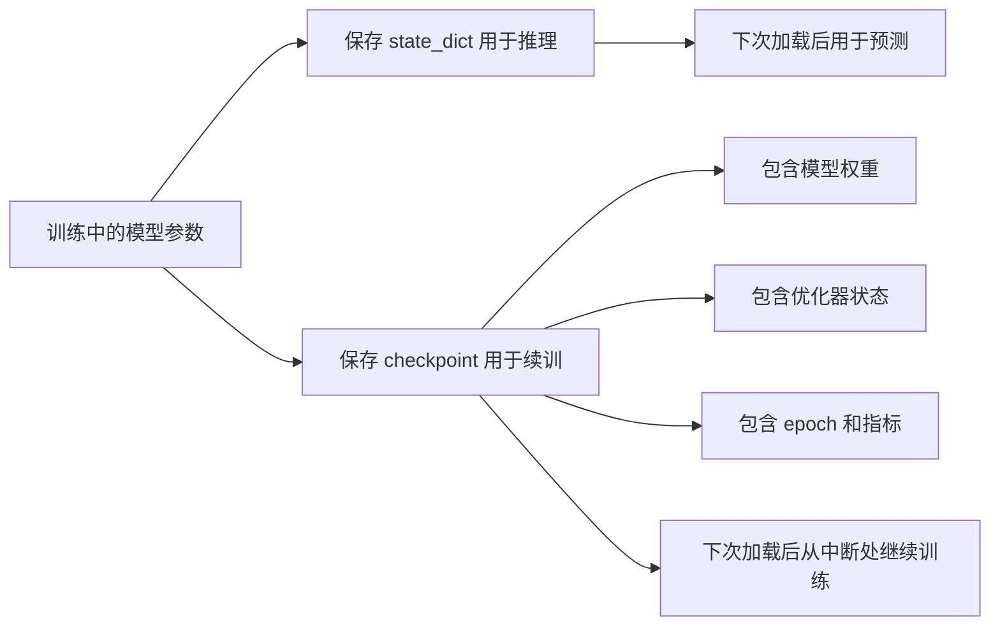

# EP10｜模型保存、加载与断点续训


作者：吴佳浩

撰稿时间：2026-06-03

## 本篇你会学到什么

这一篇承接前面的训练与评估，开始把实验脚本升级为更像真实项目的训练工程。学完这一篇，你应该能够：

- 理解为什么训练好的模型必须保存，而不是只停留在当前进程内存里
- 分清“保存模型用于推理”和“保存 checkpoint 用于继续训练”的区别
- 学会使用 `state_dict()` 保存和加载模型参数
- 知道断点续训时除了模型权重还应该保存哪些状态
- 理解 `optimizer.state_dict()`、`epoch`、最佳指标等信息为什么重要
- 在本地 Windows 目录下规范地管理 checkpoint 文件

---

## 一、为什么模型保存是项目中必不可少的一步

前面你已经能训练一个模型了，但如果训练结束后你什么都不保存，会发生什么？

- 关闭脚本后，内存里的参数就没了
- 下次想推理，只能重新训练
- 训练中断后，之前的进度也丢了
- 无法稳定复现实验结果

所以在真实项目里，训练不是“跑完就结束”，而是至少要解决两个问题：

1. **如何保存一个可用于推理的模型权重**
2. **如何保存一个可恢复训练状态的断点文件（checkpoint）**

这两者看起来很像，但用途并不完全一样。

---

## 二、核心理论讲解

### 1. 什么是 `state_dict`

`state_dict` 可以理解成：

> **模型当前所有可学习参数的参数字典。**

例如一个线性层里有：

- weight
- bias

这些参数都会被组织进 `state_dict()` 里。

PyTorch 最推荐、最常见的保存方式，就是保存这个参数字典，而不是直接把整个 Python 模型对象一股脑序列化。

### 2. 为什么推荐保存 `state_dict()`，而不是整个模型对象

因为保存整个模型对象虽然看起来方便，但通常问题更多。你可以把两者的差别粗略理解成：

- 保存整个模型对象：更像把“当时那一刻的整套 Python 对象状态”整体打包
- 保存 `state_dict()`：更像只把“真正重要的参数结果”按规范方式存下来

在教程学习和项目实践里，后者通常更稳。

因为保存整个模型对象虽然看起来方便，但通常问题更多：

- 更依赖当时的代码结构
- 跨文件、跨环境兼容性可能更差
- 后续项目结构稍有调整就可能加载失败

而保存 `state_dict()` 的好处通常是：

- 文件更轻
- 更稳妥
- 兼容性更好
- 更符合 PyTorch 主流工程习惯

### 3. “模型保存” 和 “断点续训保存” 的区别

这是这一篇最重要的概念之一。

#### 用于推理的模型保存

目标是：

- 下次直接加载模型参数
- 用来做预测或部署

这时通常只需要：

- 模型结构定义
- 模型参数 `state_dict`

#### 用于继续训练的 checkpoint 保存

目标是：

- 下次从中断处继续训练
- 尽量恢复训练上下文

这时通常除了模型参数，还需要保存：

- 优化器状态
- 当前 epoch
- 当前 best metric
- 最近一次 loss / val_acc 等信息
- （视情况）学习率调度器状态

这两类保存文件的用途不同，不要混在一起理解。

### 4. 为什么断点续训必须保存优化器状态

很多初学者会想：

- 我不是已经保存模型参数了吗？
- 下次直接把模型权重加载回来不就行了？

如果你只是做推理，这样没问题。

但如果你要**继续训练**，只恢复模型权重还不够。因为优化器内部也维护着训练状态，尤其像 Adam 这类优化器，会保存历史动量和二阶统计信息。

如果你不恢复优化器状态：

- 虽然模型参数回来了
- 但优化器相当于“失忆”了
- 继续训练的轨迹可能和原来中断前不一致

### 5. 为什么加载模型前必须先定义模型结构

`state_dict` 保存的是参数值，不是自动帮你重新发明模型结构。

所以加载前你必须先有一个**结构一致的模型实例**，然后再把参数填进去。

这也是为什么常见加载流程是：

1. 先定义模型类
2. 实例化模型
3. `load_state_dict()`

如果当前模型结构和保存时不一致，加载就可能失败。

---

## 三、先建立一个直觉理解

你可以把模型保存理解成两种不同层级的“存档”。

### 存档类型 1：只存角色装备

这类似于：

- 保存了角色当前武器和属性
- 下次可以直接拿来战斗

对应到 PyTorch，就是：

- 只保存模型参数 `state_dict`

适合：

- 推理
- 部署
- 评估

### 存档类型 2：保存整个游戏进度

这类似于：

- 不只保存角色装备
- 还保存关卡进度、背包状态、经验值、当前任务位置

对应到 PyTorch，就是 checkpoint：

- 模型参数
- 优化器状态
- epoch
- 指标记录
- 调度器状态等

适合：

- 断点续训
- 长时间训练任务
- 实验中断恢复

---

## 四、真实项目里怎么用

### 场景 1：训练结束后保存最佳模型用于部署

这是最常见用途之一。

例如你训练一个图片分类器，验证集效果最好的那一轮模型，需要保存下来，后续用于：

- 本地推理脚本
- API 服务部署
- 导出到别的系统

这时通常保存的是：

- 最佳模型权重 `best_model.pt`

### 场景 2：训练跑到一半中断后继续训练

真实训练中很常见：

- 电脑重启
- 程序意外退出
- 你想第二天接着训

这时 checkpoint 就特别重要。

### 场景 3：保存每轮 / 最佳轮训练记录

真实项目里往往会区分：

- `last_checkpoint.pt`：最新训练断点
- `best_model.pt`：验证集表现最好的模型

这两个文件都很重要，但用途不同。

---

## 五、流程图 / 结构图（Mermaid）

下面这张图展示了训练、保存、恢复之间的关系：



你要记住：

- `best_model.pt` 和 `last_checkpoint.pt` 不一定是同一个概念
- 一个偏“最终成果”，一个偏“过程恢复”

---

## 六、最推荐的基础保存方式：保存模型权重

先看最常用、最稳妥的做法：保存模型参数字典。

```python
import os
import torch

# 确保 checkpoints 目录存在
os.makedirs("checkpoints", exist_ok=True)

# 保存模型参数字典
# 这通常适合后续做推理、评估或部署
torch.save(model.state_dict(), "checkpoints/mnist_model.pt")

print("模型权重已保存到 checkpoints/mnist_model.pt")
```

这段代码的关键点：

- 使用 `os.makedirs(..., exist_ok=True)` 避免目录不存在报错
- 保存的是 `model.state_dict()`，不是整个模型对象

---

## 七、加载模型权重用于推理

加载模型时，最重要的前提是：

> **你必须先有和保存时一致的模型结构定义。**

下面我们复用前面的一个入门模型示例：

```python
import torch
import torch.nn as nn


class MNISTNet(nn.Module):
    def __init__(self):
        super().__init__()
        self.net = nn.Sequential(
            nn.Flatten(),
            nn.Linear(28 * 28, 128),
            nn.ReLU(),
            nn.Linear(128, 10)
        )

    def forward(self, x):
        return self.net(x)


# 1. 先实例化模型结构
model = MNISTNet()

# 2. 加载参数字典
# map_location='cpu' 可以避免“在没有 GPU 的机器上加载 GPU 存档”时报错
state_dict = torch.load("checkpoints/mnist_model.pt", map_location="cpu")

# 3. 把参数填回当前模型
model.load_state_dict(state_dict)

# 4. 切换到评估模式
# 推理时是个好习惯，尤其对含 Dropout / BatchNorm 的模型很重要
model.eval()

print("模型加载完成，已切换到 eval 模式。")
```

---

## 八、断点续训：真正需要保存什么

如果你希望下次继续训练，而不是只做推理，那么最少建议保存这些内容：

- `epoch`
- `model_state_dict`
- `optimizer_state_dict`
- 当前 loss 或验证指标

下面是一种很常见的 checkpoint 保存方式：

```python
import os
import torch

os.makedirs("checkpoints", exist_ok=True)

torch.save(
    {
        # 当前训练到了第几轮
        "epoch": epoch,

        # 当前模型参数
        "model_state_dict": model.state_dict(),

        # 当前优化器状态
        "optimizer_state_dict": optimizer.state_dict(),

        # 额外记录一个最近 loss，便于恢复时查看
        "loss": loss.item(),
    },
    "checkpoints/last_checkpoint.pt"
)

print("断点 checkpoint 已保存。")
```

这里最关键的是：

- 这不是单纯保存一个模型参数文件
- 而是在保存“训练现场状态”

---

## 九、从 checkpoint 恢复继续训练

下面演示如何恢复训练。

```python
import torch
import torch.nn as nn
import torch.optim as optim


class MNISTNet(nn.Module):
    def __init__(self):
        super().__init__()
        self.net = nn.Sequential(
            nn.Flatten(),
            nn.Linear(28 * 28, 128),
            nn.ReLU(),
            nn.Linear(128, 10)
        )

    def forward(self, x):
        return self.net(x)


# 1. 先重建模型和优化器结构
model = MNISTNet()
optimizer = optim.Adam(model.parameters(), lr=1e-3)

# 2. 加载 checkpoint
ckpt = torch.load("checkpoints/last_checkpoint.pt", map_location="cpu")

# 3. 恢复模型参数
model.load_state_dict(ckpt["model_state_dict"])

# 4. 恢复优化器状态
optimizer.load_state_dict(ckpt["optimizer_state_dict"])

# 5. 计算恢复后的起始 epoch
start_epoch = ckpt["epoch"] + 1

# 6. 读取附加记录信息
last_loss = ckpt.get("loss")

print("从 epoch 恢复:", start_epoch)
print("上次记录 loss:", last_loss)
```

注意这里的核心逻辑：

- 模型要恢复
- 优化器也要恢复
- epoch 要接上

否则你只是“加载了老参数”，并不是真正意义上的断点续训。

---

## 十、一个更真实的训练中保存最佳模型思路

真实项目里通常不会只保存 `last_checkpoint.pt`，还会保存验证集最好的模型。

下面给一个简化例子：

```python
best_val_acc = 0.0

for epoch in range(num_epochs):
    # 假设这里完成了训练与验证
    train_loss = ...
    val_acc = ...

    # 每轮都更新最新 checkpoint，便于中断恢复
    torch.save(
        {
            "epoch": epoch,
            "model_state_dict": model.state_dict(),
            "optimizer_state_dict": optimizer.state_dict(),
            "val_acc": val_acc,
        },
        "checkpoints/last_checkpoint.pt"
    )

    # 如果当前验证集表现更好，就额外保存最佳模型
    if val_acc > best_val_acc:
        best_val_acc = val_acc
        torch.save(model.state_dict(), "checkpoints/best_model.pt")
        print(f"发现更优模型，已保存 best_model.pt，val_acc={val_acc:.4f}")
```

这个思路非常实用，因为它同时满足两件事：

- 训练中断了可以继续
- 最优模型不会被后面可能退化的 epoch 覆盖掉

---

## 十一、本地 Windows 环境建议

建议统一把模型文件放到：

```text
G:\openclaw\docs\PyTorch-教程\checkpoints\
```

并至少区分这几类文件：

- `best_model.pt`：验证集表现最好的模型，偏部署 / 推理用途
- `last_checkpoint.pt`：最近一次训练断点，偏续训用途
- `epoch_XX.pt`（可选）：按轮保存的历史快照

这样目录会清晰很多，不容易混乱。

---

## 十二、运行结果应该怎么看

### 1. 保存后是否真的生成文件

不要只看终端打印，要去目录里确认：

- 文件是否存在
- 文件大小是否正常

### 2. 加载后模型是否能正常前向传播

加载成功不等于真正可用。最稳妥的做法是：

- 加载后立刻做一次前向推理测试

### 3. 续训时 epoch 是否接上了

如果你之前训练到第 4 轮，那么恢复后通常应该从第 5 轮开始。

### 4. 最佳模型和最后断点是否被混淆

这点很容易乱。建议从文件命名阶段就严格区分。

---

## 十三、常见错误与排查

### 问题 1：模型类没定义就直接加载

你不能只写：

```python
model = MNISTNet()
```

却没有定义或导入 `MNISTNet`。

### 问题 2：当前模型结构和保存时不一致

这是加载失败的高频原因。

例如：

- 保存时最后一层输出是 10 类
- 现在却改成了 2 类

这时参数 shape 对不上，加载就会报错。

### 问题 3：GPU 训练文件在 CPU 环境加载失败

这是很常见的跨设备情况。

解决办法通常是：

```python
torch.load(path, map_location="cpu")
```

### 问题 4：以为只保存模型参数就能完美续训

如果要继续训练，别忘了优化器状态也非常关键。

### 问题 5：只保存最后一次，不保存最佳模型

有时最后一轮并不是最优轮。只保存最后一次，可能会丢掉最佳模型版本。

---

## 十四、本篇小结

这一篇最核心的认知是：

- `state_dict()` 是最推荐的模型保存方式
- 只做推理时，通常保存模型参数就够了
- 断点续训时，要额外保存优化器状态、epoch 和指标信息
- 模型加载前必须先有一致的结构定义
- `best_model.pt` 和 `last_checkpoint.pt` 代表的是两种不同用途的存档

如果你把这一篇真正掌握了，你的训练代码就开始具备“工程可持续性”了，而不只是一次性实验脚本。

---

## 十五、练习题

### 练习 1：保存一个模型权重文件
用你前面训练过的 MNIST 模型，保存一个：

- `checkpoints/mnist_model.pt`

然后重新启动脚本把它加载回来。

### 练习 2：保存并恢复 checkpoint
在训练循环中增加 `last_checkpoint.pt` 保存逻辑，然后模拟“中断后继续训练”。

### 练习 3：同时保存最佳模型和最后断点
训练时区分保存：

- `best_model.pt`
- `last_checkpoint.pt`

观察它们在用途上的区别。

### 练习 4：故意制造一次结构不匹配
尝试把模型输出类别数从 `10` 改成 `2`，然后加载旧权重，看看会报什么错。

### 练习 5：思考题
为什么说：

- 保存模型权重 ≠ 保存训练现场
- 恢复模型参数 ≠ 完整恢复训练状态

请用你自己的话解释这两组区别。

---

## 一个很实用的文件管理建议

从这一篇开始，建议你把模型文件固定分成两类：

- `best_model.pt`：偏向“最好效果，用于推理或交付”
- `last_checkpoint.pt`：偏向“训练现场，用于中断恢复”

不要把所有保存文件都叫 `model.pt`。名字一旦太模糊，后面你自己都容易混淆：

- 这个文件到底是最佳模型，还是最后一轮模型？
- 它到底能不能继续训练？
- 这个文件里到底有没有优化器状态？

工程里很多混乱，不是因为技术太复杂，而是因为命名太含糊。

---

## 下一篇预告

下一篇我们会把前面已经掌握的训练能力，进一步升级到真实图像项目里非常常见的一条路线：**迁移学习**。

你会开始理解：

- 为什么很多项目不从零训练
- 预训练权重真正带来的价值是什么
- 冻结主干、替换分类头、微调这些操作在工程里分别意味着什么
