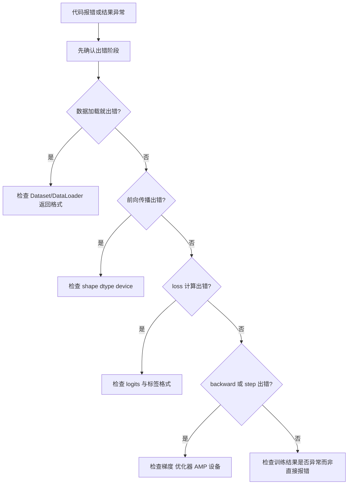

# EP14｜常见报错排查与调试技巧


作者：吴佳浩

撰稿时间：2026-06-03

## 本篇你会学到什么

这一篇承接前面的训练、部署与工程实践，专门处理学习过程中最容易把人卡住的现实问题：报错与定位。学完这一篇，你应该能够：

- 理解 PyTorch 报错为什么不能只看最后一行就慌
- 学会把高频错误按类型分类，而不是一报错就盲猜
- 掌握最有效的一批调试动作：打印 shape、dtype、device、loss、grad
- 学会从报错信息反推问题大概落在哪一层或哪一步
- 建立“先缩小问题，再逐步定位”的本地调试习惯
- 把调试当成训练代码的一部分工程能力，而不是临时救火

---

## 一、为什么很多人不是不会 PyTorch，而是不会排错

学 PyTorch 时，真正让人卡住的往往不是“一个 API 不知道”，而是：

- 代码看起来都对
- 结果一运行就报错
- 错误信息一长串
- 不知道该从哪里下手

这时候很多新手会进入两个极端：

1. **瞎改模式**：哪里像问题就改哪里，越改越乱
2. **复制搜索模式**：把报错整段贴上网搜，但自己并不理解错误属于哪一类

这两种方式都不稳定。

更好的方法是先建立一个认知：

> **大多数 PyTorch 报错，本质上都集中在少数几个高频类别里。**

比如：

- shape 不匹配
- device 不一致
- dtype 不合适
- 模型结构和权重不一致
- 推理和训练模式混用
- 数据管道返回格式不对

一旦你能先把错误归类，定位速度会快很多。

---

## 二、核心理论讲解

## 排错优先级清单（最高频 → 先查）

在真正开始深入排查之前，先把下面这几个问题按优先级过一遍。绝大多数 PyTorch 报错，第一项检查就能定位到根源：

### 优先级 1：打印 shape

任何报错出现时，第一件事不是看错误全文，而是：

```python
print(x.shape)
```

因为 80% 的初学者报错，本质上都是 shape 不匹配。

### 优先级 2：检查 dtype

```python
print(x.dtype)
```

尤其是分类标签是 int64 还是 float32，参数是 float32 还是 float64。很多损失函数和层对 dtype 有硬性要求。

### 优先级 3：检查 device

```python
print(x.device, model.weight.device)
```

模型和数据不在同一设备上，是 GPU 训练里最常见的一类沉默报错。

### 优先级 4：检查 DataLoader 返回值格式

```python
batch = next(iter(train_loader))
print(type(batch), len(batch))
print(batch[0].shape, batch[1].shape)
```

很多训练问题不是模型写错了，而是 DataLoader 送出来的格式不符合预期。

### 优先级 5：检查参数是否真正可训练

```python
for name, param in model.named_parameters():
    print(name, param.shape, param.requires_grad)
```

当你做了冻结、迁移学习、自定义层之后，有些参数可能意外地被设成了不可训练。

### 优先级 6：检查梯度是否真的在流动

```python
loss.backward()
for name, param in model.named_parameters():
    if param.grad is None:
        print(f"WARNING: {name} has no grad!")
    elif param.grad.abs().max() < 1e-8:
        print(f"SUSPICIOUS: {name} grad is near zero: {param.grad.abs().max()}")
```

梯度消失、冻结失误、requires_grad 设置错误，这几种情况都可以用这个检测出来。

---

**这个清单的核心思想是：**

> 不要一看到报错就从头到尾通读——先做 6 项最快检查，多数问题在前 3 步就能定位。

---

### 1. 调试的本质不是“修 bug”，而是“缩小不确定性”

遇到报错时，不要第一反应就是：

- 再试一遍
- 多改几处
- 换一种写法碰碰运气

真正有效的调试逻辑是：

1. 确认错误发生在哪个阶段
2. 确认参与对象是什么
3. 打印关键中间状态
4. 缩小到最小可复现范围
5. 再做针对性修复

也就是说，调试不是玄学，而是一个逐步收窄问题空间的过程。

### 2. 为什么 shape、dtype、device 是最高频检查项

因为深度学习训练里最常见的问题，本质上都围绕 Tensor 的三个属性：

- `shape`
- `dtype`
- `device`

模型不认识“你本来想干什么”，它只看你实际给了什么。

所以很多报错并不是模型逻辑复杂，而只是：

- 维度不对
- 类型不对
- 设备不对

这也是为什么一套最实用的调试动作，往往就是先打印这三项。

### 3. 为什么不要一开始就在复杂大脚本里调

如果你的训练脚本同时包含：

- 数据加载
- 模型定义
- 训练循环
- 验证逻辑
- 保存 checkpoint
- 推理逻辑

那一旦出错，定位会很慢。

所以一个非常重要的工程调试原则是：

> **先把问题缩成最小可复现片段。**

例如：

- 先只跑一个 batch
- 先只跑前向传播
- 先只打印中间 shape
- 先在 CPU 跑通再上 GPU

---

## 三、先建立一个直觉理解

你可以把调试看成“查流水线事故”。

假设一条流水线从：

- 数据输入
- 预处理
- 模型前向传播
- loss 计算
- backward
- optimizer 更新

一路往下走。

一旦出问题，不要直接把整条线全拆了，而是应该问：

- 是原料就错了吗？
- 是中间某一站 shape 变坏了吗？
- 是设备不一致吗？
- 是参数加载不对吗？

调试越像查流程，越容易定位；越像乱翻零件，越容易把问题搞复杂。

---

## 四、高频报错类型一：设备不一致

这是最经典也最常见的问题之一。

### 常见报错

```text
Expected all tensors to be on the same device
```

### 典型原因

例如：

- 模型在 GPU
- 输入 `x` 在 CPU
- 标签 `y` 还在 CPU

或者：

- 模型已经 `.to(device)`
- 但某个中间张量是手动新建的，仍在默认 CPU 上

### 最直接的排查动作

```python
print("x.device =", x.device)
print("y.device =", y.device)
print("model device =", next(model.parameters()).device)
```

### 修复思路

统一使用一个 `device` 变量，并且：

```python
x = x.to(device)
y = y.to(device)
model = model.to(device)
```

---

## 五、高频报错类型二：维度不匹配

### 常见报错

```text
mat1 and mat2 shapes cannot be multiplied
```

### 典型原因

这通常发生在：

- 线性层输入维度和前一层输出维度不一致
- 图片 Flatten 后维度算错
- CNN 最后接全连接层时 `Linear` 输入写错

### 最直接的排查动作

```python
print("x.shape =", x.shape)
print("logits.shape =", logits.shape)
```

如果是多层模型，建议在关键节点打印：

```python
print("after conv1:", x.shape)
print("after pool1:", x.shape)
print("after flatten:", x.shape)
```

### 修复思路

不要靠猜，要按层推导 shape。

尤其在 CNN 中，你要明确：

- 通道数怎么变
- 宽高怎么变
- Flatten 后到底是多少维

---

## 六、高频报错类型三：dtype 不对

### 常见报错

```text
expected scalar type Long but found Float
```

或者：

```text
expected scalar type Float but found Long
```

### 典型原因

最常见的是分类任务里：

- 输入应该是浮点 Tensor
- 标签应该是 `long`

但实际却混了。

### 最直接的排查动作

```python
print("x.dtype =", x.dtype)
print("y.dtype =", y.dtype)
```

### 修复思路

常见处理方式：

```python
x = x.float()
y = y.long()
```

当然，最好是在数据管道阶段就把类型整理正确，而不是每次临时补救。

---

## 七、高频报错类型四：模型结构和权重不一致

### 常见现象

加载权重时报错，通常会看到类似：

- missing keys
- unexpected keys
- size mismatch

### 典型原因

例如：

- 训练时最后输出 10 类
- 推理时你把模型改成了 2 类
- 或训练时隐藏层宽度改了，推理脚本没同步修改

### 最直接的排查动作

先确认：

- 当前模型结构定义是否和训练时一致
- 权重文件是否真的是对应这个模型的

### 修复思路

- 保证训练、验证、推理共用同一份 `models.py`
- 模型改结构后，不要拿旧权重强行加载

---

## 八、高频报错类型五：DataLoader / Dataset 返回格式不对

### 常见现象

你以为 `for x, y in loader:` 能正常跑，但实际：

- 返回值数量不对
- batch 结构不统一
- 某些样本 shape 不一致

### 最直接的排查动作

先不要急着跑完整训练，先单独检查：

```python
print(len(dataset))
print(dataset[0])
```

再检查一个 batch：

```python
for batch in loader:
    print(type(batch))
    print(batch)
    break
```

### 修复思路

确保：

- `__getitem__()` 返回结构固定
- 特征和标签格式统一
- 所有样本在需要堆叠的维度上可兼容

---

## 九、最有效的一组基础调试动作

下面这组打印动作非常朴素，但往往最有效：

```python
print("x.shape =", x.shape)
print("y.shape =", y.shape)
print("x.dtype =", x.dtype)
print("y.dtype =", y.dtype)
print("x.device =", x.device)
print("y.device =", y.device)
print("logits.shape =", logits.shape)
print("loss =", loss)
```

如果你已经在训练中，还可以再看梯度：

```python
for name, param in model.named_parameters():
    if param.grad is not None:
        print(name, param.grad.shape)
        break
```

这些动作的价值在于：

- 不依赖猜测
- 能快速确认关键状态
- 很适合本地逐步缩小问题范围

---

## 十、一个更像工程实践的调试顺序

下面给一个非常实用的排错顺序，你以后可以直接照着走。

### 第 1 步：先只跑一个 batch

不要一上来整个 epoch 全跑。先把问题缩成：

- 能否取出一个 batch
- 能否做一次前向传播
- 能否算出一次 loss

### 第 2 步：只看前向传播

如果连前向传播都过不去，就先别急着看 backward。

### 第 3 步：确认 loss 能正常得到

loss 是训练闭环的重要中点。

如果前向能跑但 loss 不能算，通常是：

- logits 形状不对
- 标签类型不对
- 损失函数选错

### 第 4 步：再看 backward 和 optimizer.step

如果前面都正常，再逐步看：

- backward 是否报错
- 梯度是否存在
- step 是否正常完成

### 第 5 步：最后再考虑 GPU、AMP、并行等优化

不要在基础训练都没跑通时就叠太多复杂因素。

---

## 十一、Mermaid 调试流程图



这张图的重点不是形式，而是帮你建立一个顺序：

- 先判定出错阶段
- 再看对应层面的关键状态

---

## 十二、本地开发中的高价值调试习惯

### 1. 一次只改一个变量

如果你同时改了：

- 模型结构
- batch size
- 学习率
- 数据预处理
- device

那一旦出错，就很难知道根因是什么。

### 2. 先小 batch 跑通

比如先用：

- `batch_size=4`
- `batch_size=8`

这样更容易快速定位问题，也更省资源。

### 3. 先 CPU 跑通，再迁移到 GPU

尤其在 Windows 本地环境下，这个顺序非常稳。

### 4. 关键位置打印，不要全局乱 print

调试打印不是越多越好，而是要打在关键节点：

- 数据进入模型前
- 模型输出后
- loss 计算前后
- backward 后检查梯度

### 5. 建立“先验证结构，再追求速度”的心态

很多人其实不是卡在模型思想上，而是卡在脚手架不稳。先把结构跑顺，后面反而更快。

---

## 十三、本篇小结

这一篇最重要的认知是：

- PyTorch 报错大多数可以先归类到少数高频问题中
- shape、dtype、device 是最高优先级检查项
- 调试的本质是缩小不确定性，而不是碰运气改代码
- 先把问题缩成最小可复现，再逐层排查
- 本地调试习惯本身，就是你工程能力的一部分

如果你把这一篇真正用起来，后面遇到报错时就不会只是“慌”，而会更像一个能系统排查问题的人。

---

## 十四、练习题

### 练习 1：故意制造一个 shape 错误
把某个线性层输入维度故意改错，观察报错，并通过打印中间 shape 找到问题。

### 练习 2：故意制造一个 device 错误
让模型在 GPU、输入在 CPU（如果你有 GPU），观察报错并修复。

### 练习 3：故意制造一个 dtype 错误
把分类标签改成 `float32`，再看损失函数会发生什么。

### 练习 4：单独检查 DataLoader
不要训练模型，只打印：

- `len(dataset)`
- `dataset[0]`
- 第一个 batch 的结构

确认你真的会从数据源开始排查。

### 练习 5：思考题
为什么说真正高效的调试，不是“更会搜报错”，而是“更会把问题缩小并分类定位”？

---

## 下一篇预告

下一篇我们会把前面 14 篇的内容真正收束起来，进入 **项目实战：整理一个可复用训练模板**。

到那时你会把这些能力第一次系统打包：

- 数据怎么组织
- 模型怎么定义
- 训练、评估、推理怎么拆分
- 配置、输出、checkpoint 怎么管理

---

## 下一篇预告

下一篇我们会把前面 14 篇的内容真正收束起来，进入 **项目实战：整理一个可复用训练模板**。

到那时你会把这些能力第一次系统打包：

- 数据怎么组织
- 模型怎么定义
- 训练、评估、推理怎么拆分
- 配置、输出、checkpoint 怎么管理
