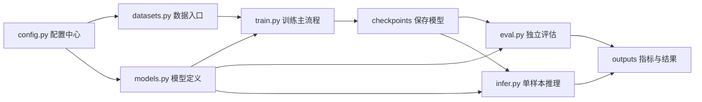

# EP15｜项目实战：整理一个可复用训练模板


作者：吴佳浩

撰稿时间：2026-06-03

## 本篇你会学到什么

这一篇是整个 PyTorch 系列的收束篇，目标不是再学一个零散知识点，而是把前面所有能力真正整理成一个可反复复用的工程骨架。学完这一篇，你应该能够：

- 把前面 14 篇教程里的核心能力收束成一个可维护的小型项目骨架
- 理解为什么真正有价值的不是“跑通一次”，而是“以后能反复复用”
- 学会把数据、模型、训练、评估、推理、配置分离到不同文件中
- 知道一个本地 Windows 环境下足够实用的训练模板应该长什么样
- 建立“以后做新任务时先改模板，而不是从零散装拼代码”的工程习惯

---

## 一、为什么一定要做“训练模板”

如果你前面 14 篇内容都只是零散学过，但从来没有把它们收束成一个项目骨架，那么很快会遇到这些问题：

- 数据读取逻辑散落在多个脚本里
- 模型结构训练时改过，推理脚本忘了同步
- checkpoint 路径到处写死
- 日志、输出文件、结果图没有固定位置
- 下次做新任务时又重新从零拼装脚本

这时候你会发现：

> **你不是不会 PyTorch，而是没有形成可复用的工程模板。**

所以这一篇的重点，不是再引入什么新 API，而是把前面学过的内容整理成：

- 一个职责清晰的目录结构
- 一组能复用的脚本入口
- 一套更稳定的本地开发方式

这一步非常重要，因为它决定了你以后做第二个、第三个项目时，会越来越快，还是每次都重新踩坑。

---

## 二、核心理论讲解

### 1. 什么叫“可复用训练模板”

可复用训练模板，不是指一个超级复杂的大型框架，而是：

> **一个在新任务到来时，你只需要替换少数关键模块，就能继续工作的项目骨架。**

它至少要做到：

- 数据处理逻辑集中管理
- 模型定义统一管理
- 训练、评估、推理入口分离
- 配置集中管理
- 输出目录有固定位置

### 2. 为什么职责分离这么重要

如果你把所有逻辑都塞进一个 `train.py`，短期当然也能跑，但随着项目变复杂，问题会越来越多：

- 修改数据处理时容易影响训练逻辑
- 修改模型结构时容易忘记同步推理代码
- 路径和超参数改动难以统一管理
- 调试和排错困难

职责分离的本质，不是为了“看起来专业”，而是为了：

- 更容易改
- 更容易查
- 更容易复用

### 3. 为什么模板比“复制旧脚本再乱改”更值钱

很多人做新任务时的方式是：

- 找一个旧项目
- 复制整个目录
- 到处搜索替换
- 然后开始冒出各种奇怪问题

这说明项目结构本身并没有模块化。

真正好的模板应该让你知道：

- 换数据，改哪里
- 换类别数，改哪里
- 换模型，改哪里
- 推理时共用哪份结构定义

也就是说，模板真正提供的是：

> **明确的修改边界。**

---

## 三、先建立一个直觉理解

你可以把项目模板理解成“一个已经收好的工具箱”。

- `datasets.py` 像原料入口
- `models.py` 像机器设计图
- `train.py` 像生产主线
- `eval.py` 像质检流程
- `infer.py` 像成品交付入口
- `config.py` 像总控面板

如果你每次都把这些东西混成一堆，后面自然会乱。

但如果这些职责已经分开，那你以后做新任务时，很多改动都只是“替换某个盒子里的内容”，而不需要把整套工具重造一遍。

---

## 四、推荐项目结构

下面这个结构已经足够支撑大多数本地小型分类任务：

```text
G:\openclaw\docs\PyTorch-教程\project_demo\
├─ data\
├─ checkpoints\
├─ outputs\
├─ datasets.py
├─ models.py
├─ train.py
├─ eval.py
├─ infer.py
└─ config.py
```

这个结构的优点是：

- 数据目录、输出目录、权重目录分开
- 训练、评估、推理入口分开
- 模型定义统一在一处
- 配置集中管理

对于个人项目和本地学习来说，这已经非常够用。

---

## 五、每个文件负责什么

### 1. `datasets.py`

负责：

- 数据集读取
- 样本预处理
- `Dataset` / `DataLoader` 构建

如果以后换数据源，优先改这里。

### 2. `models.py`

负责：

- 模型定义
- 网络结构切换
- 模型实例化

训练、评估、推理应该尽量共用这里，减少结构不一致问题。


### 文件职责速查表

你在项目里打开任意一个文件时，应该能立刻知道它在做什么：

| 文件 | 负责什么 | 被别人引用吗 |
|------|----------|-------------|
| `config.py` | 集中管理路径、超参、设备 | 几乎所有脚本都读它 |
| `datasets.py` | 定义 Dataset、预处理、数据划分 | train / eval / infer 都引用 |
| `models.py` | 定义网络结构（包括不同模型变体） | train / eval / infer 都引用 |
| `train.py` | 读取 config + data + model → 执行训练循环 → 保存最佳模型和断点 | 独立入口 |
| `eval.py` | 加载最佳模型 → 遍历测试集 → 输出指标 | 独立入口 |
| `infer.py` | 加载模型 → 接收输入 → 返回预测结果 | 独立入口 |
| `utils.py` | 通用工具函数（如日志、计时、指标计算） | 多个脚本引用 |

**记住这个规律：**

- `config` / `datasets` / `models` 是被引用的核心模块
- `train` / `eval` / `infer` 是不同目标的独立入口
- `utils` 是可选的公共工具箱

这个分工一旦建立，以后你做新任务时，只改被引用的部分（数据源、模型结构、超参），入口脚本几乎不用动。


### 3. `train.py`

负责：

- 训练循环
- loss 计算
- optimizer 更新
- 验证过程
- checkpoint 保存

### 4. `eval.py`

负责：

- 在验证集或测试集上做独立评估
- 统计 accuracy、loss 等指标

### 5. `infer.py`

负责：

- 单样本或少量样本推理
- 面向实际使用，而不是面向训练过程

### 6. `config.py`

负责：

- 路径
- 学习率
- batch size
- epoch 数
- 类别数
- 其他超参数

把这些集中管理，是减少“到处改配置”混乱的关键。

---

## 六、项目流程图（Mermaid）



这张图表达的重点是：

- 配置、数据、模型是基础层
- 训练、评估、推理是不同入口
- 权重和输出是中间产物与结果产物

---

## 七、一个最小可复用模板示例

下面给出一套足够小、但已经具备工程雏形的模板示例。

### `config.py`

```python
# 统一管理路径和超参数，避免到处硬编码
DATA_DIR = "data"
CHECKPOINT_DIR = "checkpoints"
OUTPUT_DIR = "outputs"

BATCH_SIZE = 64
LR = 1e-3
EPOCHS = 5
NUM_CLASSES = 10
```

### `models.py`

```python
import torch.nn as nn


class MNISTNet(nn.Module):
    """
    一个最基础的 MNIST 分类模型。
    训练、评估、推理都尽量共用这份定义。
    """
    def __init__(self, num_classes=10):
        super().__init__()
        self.net = nn.Sequential(
            nn.Flatten(),
            nn.Linear(28 * 28, 128),
            nn.ReLU(),
            nn.Linear(128, num_classes)
        )

    def forward(self, x):
        return self.net(x)
```

### `datasets.py`

```python
from torch.utils.data import DataLoader
from torchvision import datasets, transforms

from config import DATA_DIR, BATCH_SIZE


def build_loaders():
    """
    构建训练集和测试集的 DataLoader。
    后面如果换成别的数据集，优先改这里。
    """
    transform = transforms.ToTensor()

    train_dataset = datasets.MNIST(
        root=DATA_DIR,
        train=True,
        download=True,
        transform=transform
    )

    test_dataset = datasets.MNIST(
        root=DATA_DIR,
        train=False,
        download=True,
        transform=transform
    )

    train_loader = DataLoader(train_dataset, batch_size=BATCH_SIZE, shuffle=True, num_workers=0)
    test_loader = DataLoader(test_dataset, batch_size=BATCH_SIZE, shuffle=False, num_workers=0)

    return train_loader, test_loader
```

### `train.py`

```python
import os
import torch
import torch.nn as nn
import torch.optim as optim

from config import CHECKPOINT_DIR, LR, EPOCHS, NUM_CLASSES
from datasets import build_loaders
from models import MNISTNet


os.makedirs(CHECKPOINT_DIR, exist_ok=True)

device = "cuda" if torch.cuda.is_available() else "cpu"
train_loader, test_loader = build_loaders()

model = MNISTNet(num_classes=NUM_CLASSES).to(device)
criterion = nn.CrossEntropyLoss()
optimizer = optim.Adam(model.parameters(), lr=LR)

best_acc = 0.0

for epoch in range(EPOCHS):
    model.train()
    running_loss = 0.0

    for x, y in train_loader:
        x = x.to(device)
        y = y.to(device)

        optimizer.zero_grad()
        logits = model(x)
        loss = criterion(logits, y)
        loss.backward()
        optimizer.step()

        running_loss += loss.item()

    avg_loss = running_loss / len(train_loader)
    print(f"epoch={epoch+1}, train_loss={avg_loss:.4f}")

    # 这里做一个最基础的测试集评估示例
    model.eval()
    correct = 0
    total = 0

    with torch.no_grad():
        for x, y in test_loader:
            x = x.to(device)
            y = y.to(device)
            logits = model(x)
            preds = torch.argmax(logits, dim=1)
            correct += (preds == y).sum().item()
            total += y.size(0)

    acc = correct / total
    print(f"epoch={epoch+1}, test_acc={acc:.4f}")

    # 保存最新断点
    torch.save(
        {
            "epoch": epoch,
            "model_state_dict": model.state_dict(),
            "optimizer_state_dict": optimizer.state_dict(),
            "acc": acc,
        },
        os.path.join(CHECKPOINT_DIR, "last_checkpoint.pt")
    )

    # 保存最佳模型
    if acc > best_acc:
        best_acc = acc
        torch.save(model.state_dict(), os.path.join(CHECKPOINT_DIR, "best_model.pt"))
        print("发现更优模型，已更新 best_model.pt")
```

### `eval.py`

```python
import torch

from config import CHECKPOINT_DIR, NUM_CLASSES
from datasets import build_loaders
from models import MNISTNet


device = "cuda" if torch.cuda.is_available() else "cpu"
_, test_loader = build_loaders()

model = MNISTNet(num_classes=NUM_CLASSES).to(device)
state_dict = torch.load(f"{CHECKPOINT_DIR}/best_model.pt", map_location=device)
model.load_state_dict(state_dict)
model.eval()

correct = 0
total = 0

with torch.no_grad():
    for x, y in test_loader:
        x = x.to(device)
        y = y.to(device)
        logits = model(x)
        preds = torch.argmax(logits, dim=1)
        correct += (preds == y).sum().item()
        total += y.size(0)

print("accuracy:", correct / total)
```

### `infer.py`

```python
import sys
import torch
from PIL import Image
from torchvision import transforms

from config import CHECKPOINT_DIR, NUM_CLASSES
from models import MNISTNet


def load_model():
    model = MNISTNet(num_classes=NUM_CLASSES)
    state_dict = torch.load(f"{CHECKPOINT_DIR}/best_model.pt", map_location="cpu")
    model.load_state_dict(state_dict)
    model.eval()
    return model


def load_image(image_path):
    transform = transforms.Compose([
        transforms.Grayscale(),
        transforms.Resize((28, 28)),
        transforms.ToTensor(),
    ])
    image = Image.open(image_path)
    return transform(image).unsqueeze(0)


if __name__ == "__main__":
    image_path = sys.argv[1]
    model = load_model()
    x = load_image(image_path)

    with torch.no_grad():
        pred = torch.argmax(model(x), dim=1).item()

    print("预测结果:", pred)
```

---

## 八、在本地怎么使用这套模板

你可以按下面顺序执行：

```powershell
cd G:\openclaw\docs\PyTorch-教程\project_demo
python train.py
python eval.py
python infer.py sample.png
```

这三步分别对应：

1. 训练模型
2. 评估模型
3. 做单样本推理

这套流程看似简单，但已经具备一个小型项目最关键的闭环能力。

---

## 九、以后复用时，优先改哪些地方

真正可复用的模板，重点不是“一个文件永远不动”，而是你要知道优先改哪里。

### 最小改动项

- `datasets.py`：换成你的数据集读取逻辑
- `config.py`：改路径、batch size、学习率、类别数
- `models.py`：如果任务需要，替换模型结构

### 尽量少动的部分

- `train.py` 的训练主流程骨架
- `eval.py` 的评估框架
- `infer.py` 的推理入口

这就是模板真正节省时间的地方。

---

## 十、本地环境下最常见的三个坑

### 1. 路径写死且分散复制

Windows 本地环境里，这个问题尤其常见。最稳妥的方式是把路径集中到 `config.py`。

### 2. 训练、评估、推理使用了不同模型定义

如果这些入口不共用 `models.py`，你迟早会遇到：

- 训练能跑
- 推理加载失败

### 3. 输出文件没有固定位置

建议至少约定：

- 模型权重放 `checkpoints/`
- 指标和结果放 `outputs/`
- 原始数据放 `data/`

这样项目可维护性会高很多。

---

## 十一、本篇真正的价值

这一篇最重要的，不是让你记住某个目录名，而是让你真正跨过一个门槛：

> **从“会写几个 PyTorch 脚本”，变成“会整理一个小型可维护项目”。**

这会带来两个非常实际的变化：

1. 你做下一个任务时会更快
2. 你排错、扩展、交接都会更轻松

这其实就是工程化能力的开端。

---

## 十二、本篇小结

这一篇最核心的认知是：

- 可复用模板的价值在于明确模块职责和修改边界
- 数据、模型、训练、评估、推理、配置应该分开管理
- 一个本地小项目不需要很大，但必须结构清楚
- 模板不是为了“好看”，而是为了减少重复劳动和重复踩坑

如果你把这一篇真正落地，以后你做新任务时，基本就不需要再从零散装拼训练脚本了。

---

## 十三、练习题

### 练习 1：把现有教程代码整理进 `project_demo`
把你前面用过的 MNIST 训练代码，按本篇结构拆进：

- `datasets.py`
- `models.py`
- `train.py`
- `eval.py`
- `infer.py`

### 练习 2：给 `config.py` 增加新配置项
例如加入：

- `DEVICE`
- `WEIGHT_DECAY`
- `MODEL_NAME`

并让其他脚本读取它们。

### 练习 3：把最佳模型与最后断点分开保存
在模板中同时支持：

- `best_model.pt`
- `last_checkpoint.pt`

### 练习 4：把推理脚本改成支持目录输入
除了单张图片，再支持传一个目录，遍历所有图片并逐个输出结果。

### 练习 5：思考题
为什么说真正高效的项目推进方式，不是“每次都重新写一套脚本”，而是“不断打磨一个可以复用的模板骨架”？

---

## 系列收尾建议

如果你已经完整走到这一篇，接下来最值得做的不是再看一遍目录，而是动手把这套骨架真正用在一个小项目里。

建议你至少做一次完整闭环：

1. 选一个你熟悉的小数据集或现成任务
2. 按本篇模板整理目录结构
3. 跑通训练、评估、保存、推理全流程
4. 记录你在数据、模型、调试、部署阶段遇到的真实问题

只有当你真正把模板用起来，它才会从“教程里的结构图”变成你自己的工程能力。

---

## 系列收尾建议

如果你已经完整走到这一篇，接下来最值得做的不是再看一遍目录，而是动手把这套骨架真正用在一个小项目里。

建议你至少做一次完整闭环：

1. 选一个你熟悉的小数据集或现成任务
2. 按本篇模板整理目录结构
3. 跑通训练、评估、保存、推理全流程
4. 记录你在数据、模型、调试、部署阶段遇到的真实问题

只有当你真正把模板用起来，它才会从“教程里的结构图”变成你自己的工程能力。
