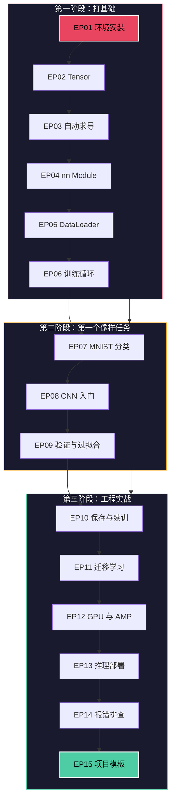
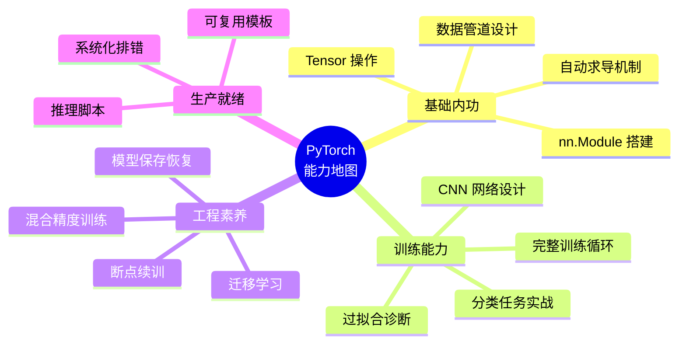
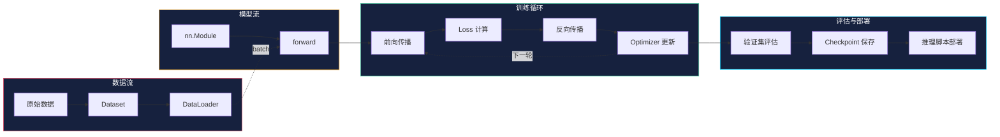
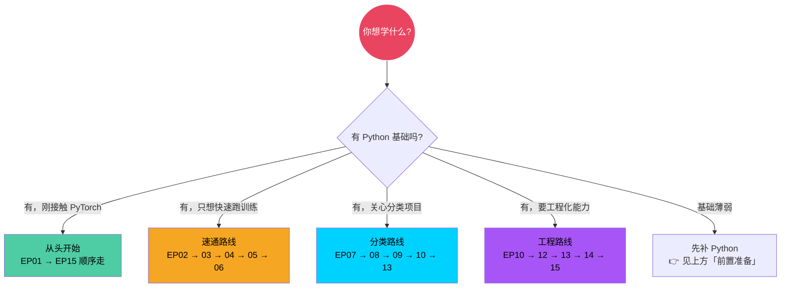
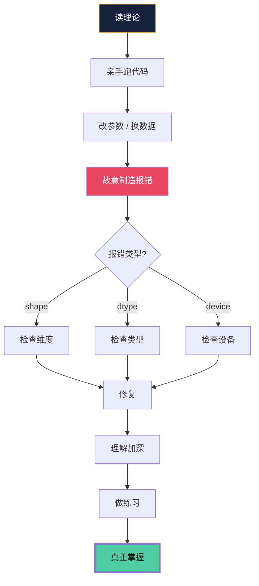

<p align="center">
  
</p>

<h1 align="center">PyTorch 从入门到项目闭环</h1>
<h3 align="center">15 篇 · 本地 Windows 实战 · RTX 5090 实测</h3>

<p align="center">
  
  
  
  
  
</p>

<p align="center">
  <b>作者：</b>吴佳浩 &nbsp;|&nbsp; <b>撰稿：</b>2026-05-25 &nbsp;|&nbsp; <b>实测：</b>RTX 5090 + 96GB + Windows 11
</p>

---

<p align="center">
  <b>不是"API 大全"，不是"Hello World 堆砌"，不是"看完还是不会做项目"</b><br>
  <b>这是一套让你从 <code>import torch</code> 走到独立完成一个完整项目闭环的实战教程</b>
</p>

---

## 为什么是 PyTorch？

### PyTorch 是什么

PyTorch 是由 Meta（原 Facebook）AI 研究院（FAIR）开发并开源的深度学习框架，核心基于 Torch 库，于 2016 年发布第一个公开版本。经过近十年的迭代，PyTorch 已经从单纯的"科研工具"发展为覆盖研究、开发、部署全链路的工业级框架。

PyTorch 的底层是一个高效的张量计算引擎，支持 GPU 加速和多节点分布式训练。它的上层提供了 `torch.nn`、`torch.optim`、`torch.utils.data` 等模块，将深度学习中最常见的构建、训练、数据加载环节封装得极度灵活且直观。

### 为什么 PyTorch 统治了深度学习

2017 年前后，深度学习框架之争的核心玩家是 TensorFlow 和 PyTorch。TensorFlow 采用了**静态计算图**——你需要先定义整个计算图，再提交执行。PyTorch 则选择了**动态计算图（Define-by-Run）**——在哪里写代码就在哪里构建图，运行到哪行就执行到哪行。

这个设计差异带来了三个决定性优势：

1. **调试体验**：PyTorch 的代码可以直接用 `print`、`pdb`、IDE 断点调试，因为每一行都在你写的时候立即执行。TensorFlow 1.x 需要先构建图、再 `Session.run()`，中间出了错很难定位。
2. **控制流自由**：PyTorch 中 `if`、`for`、`while` 等 Python 原生的控制流天然融入计算图，不需要学习特殊的控制流 API。这意味着你可以根据数据动态改变网络结构，这在 NLP 和强化学习中尤其重要。
3. **Pythonic 设计**：PyTorch 的 API 风格极度贴近 Python 和 NumPy 的使用习惯。`torch.Tensor` 的行为和 `numpy.ndarray` 几乎一致，学习曲线非常平滑。

这些优势让 PyTorch 在学术界迅速占据统治地位。根据 Papers with Code 的统计，从 2019 年开始，顶级会议中超过 75% 的论文使用 PyTorch 实现，到 2024 年这个比例已经超过 90%。工业界同样快速跟进——OpenAI、Tesla、Microsoft、NVIDIA 都将 PyTorch 作为主力框架。

### PyTorch 的生态系统

PyTorch 不是一个孤立的核心库，它背后有一个庞大的官方和社区生态：

| 组件 | 定位 | 一句话说明 |
|:--|:--|:--|
| `torch` | 核心库 | 张量计算 + 自动求导 + GPU 加速 |
| `torch.nn` | 神经网络模块 | 层、激活函数、损失函数、参数管理 |
| `torch.optim` | 优化器 | SGD、Adam、AdamW 等主流优化算法 |
| `torch.utils.data` | 数据加载 | Dataset + DataLoader，支持多进程、分布式采样 |
| `torchvision` | 计算机视觉 | 预训练模型（ResNet、ViT 等）、数据集、图像变换 |
| `torchaudio` | 音频处理 | 音频 I/O、特征提取、预训练模型 |
| `torchtext` | 自然语言处理 | 文本数据集、词表、分词工具 |
| `torch.cuda.amp` | 混合精度训练 | 用 FP16/FP32 混合精度加速训练，几乎不损失精度 |
| `torch.compile` | 图编译加速 | PyTorch 2.0 引入，用 `torch.compile(model)` 一行代码提速 |
| `torch.distributed` | 分布式训练 | DDP、FSDP，支持多 GPU 和多节点训练 |
| `TorchServe` | 模型服务 | 训练好的模型一键部署为 REST API |
| `PyTorch Lightning` | 训练框架（社区） | 把训练样板代码抽象出来，专注模型逻辑 |
| `HuggingFace Transformers` | 预训练模型（社区） | 几行代码加载 BERT、GPT、LLaMA 等大模型 |

这套生态意味着：你学完基础 PyTorch 之后，无论是做图像分类、目标检测、语义分割，还是 NLP、语音识别、强化学习、大模型微调，都有成熟的库和预训练模型可以直接使用。你不需要从零造轮子，但你也需要理解轮子是怎么转的——这正是本教程的目标。

### TensorFlow 2.x 的追赶与结局

TensorFlow 在 2019 年发布了 2.0 版本，引入了 Eager Execution 来模拟动态图，Keras 成为官方高级 API，API 友好度大幅提升。但此时 PyTorch 已经在研究社区建立了深厚的护城河，加上 Meta、NVIDIA 等公司在生态上的持续投入，TensorFlow 已难以逆转局面。到 2025 年，PyTorch 已经成为深度学习领域事实上的标准框架，绝大多数开源项目、论文复现、竞赛方案都基于 PyTorch。

**结论很简单：如果你在 2026 年要系统学深度学习，PyTorch 是唯一值得从零投入的框架。**

---

## 前置准备

本教程假定你已经掌握了 Python 基础语法和环境配置。如果你对以下内容还不太熟悉：

- `pip` / `venv` 等包管理和虚拟环境工具
- `list`、`dict`、`tuple`、`set` 等内置数据结构
- 函数定义、`class`、模块导入
- `numpy` 基础（`ndarray` 创建、索引、切片、广播）
- 列表推导式、`lambda`、文件读写

**请先移步我的 Python 入门指南，把基础语法和环境配置掌握后再回来：**

- 掘金专栏：[Python 入门指南](https://juejin.cn/column/7294907512445206591)
- CSDN 博客：[Python 入门指南](https://blog.csdn.net/weixin_43712047/category_13098818.html)

> Python 基础不稳，学 PyTorch 会频繁卡在语法细节上，本末倒置。花一周打好基础，后面 15 篇效率翻倍。

---

## 学习路线图



---

## 你是不是也有这些症状？

- 看了无数 PyTorch 教程，API 都认识，但一到自己动手就懵
- 能跑通别人的 Notebook，但换个数据集就报一片红
- `shape`、`dtype`、`device` 报错翻来覆去搞不定
- 训练完了不知道怎么保存、怎么部署、怎么给别人用
- 每次做新任务都从零拼脚本，没有一套可复用的骨架

**如果中了两条以上 —— 这套教程就是为你写的。**

---

## 学完你能做到什么



---

## 这套教程和别的有什么不一样？

| 常见教程 | 这套教程 |
|:--|:--|
| 堆 API 列表，看完还是不会写 | 每个概念都讲 **为什么**、**什么时候用**、**不用会怎样** |
| 代码没注释，改一行就炸 | **逐行中文注释**，每行都让你看懂 |
| 没有图，全靠脑补 | 关键流程全配 **Mermaid 流程图 / 架构图** |
| 只说"怎么做"，不说"踩什么坑" | 每篇都附 **常见报错 + 排查思路** |
| 学完不知道下一步 | 每章都有 **练习题 + 章节衔接指引** |
| 示例依赖云平台 | **本地 Windows 直接跑**，有 GPU 用 GPU，没 GPU 走 CPU |

---

## 训练管线全景图



---

## 章节总览

### 第一阶段：夯实基础

> 没有地基，后面全是空中楼阁。先把 Tensor / autograd / Module / DataLoader / 训练循环吃透。

| EP | 标题 | 核心收获 |
|:--:|:--|:--|
| 01 | 环境准备与安装验证 | 本地 PyTorch 环境零报错跑通 |
| 02 | Tensor 与张量基本操作 | 搞懂 `shape` / `dtype` / `device` 三件套 |
| 03 | 自动求导与反向传播 | 理解梯度怎么自动算、反向传播在干什么 |
| 04 | 用 nn.Module 搭建第一个网络 | 学会用 Module 组织任意网络结构 |
| 05 | Dataset 与 DataLoader 数据管道 | 把任意数据变成可训练的数据管道 |
| 06 | 完整训练循环实战 | 第一次把模型 + 数据 + loss + 优化器串成闭环 |

### 第二阶段：做出第一个像样任务

> 从"会写代码片段"进化到"会看模型表现"。

| EP | 标题 | 核心收获 |
|:--:|:--|:--|
| 07 | 分类任务：手写数字识别 | 完成第一个标准分类项目（MNIST） |
| 08 | 卷积神经网络 CNN 入门 | 理解为什么 CNN 比 Flatten 更适合图像 |
| 09 | 验证集、指标与过拟合处理 | 区分"训练好看"和"真正泛化好" |

### 第三阶段：工程实战

> 不再只是训练——开始具备真正做项目的骨架能力。

| EP | 标题 | 核心收获 |
|:--:|:--|:--|
| 10 | 模型保存、加载与断点续训 | 保存、恢复、续训——训练现场永不失联 |
| 11 | 迁移学习：基于 torchvision 预训练模型 | 站在巨人肩膀上，用预训练模型加速收敛 |
| 12 | GPU、混合精度与训练加速 | 榨干显卡性能，训练快 2~5 倍 |
| 13 | 推理脚本与本地部署 | 训练好的模型真正"用起来" |
| 14 | 常见报错排查与调试技巧 | 建立系统化排错思维——不再被红字吓到 |
| 15 | 项目实战：可复用训练模板 | 把所有能力收进一个模板，下次直接复用 |

---

## 快速导航



---

## 环境搭建（3 分钟搞定）

```powershell
# 1. 进入工作目录
cd G:\openclaw\docs\PyTorch-教程

# 2. 创建虚拟环境
python -m venv .venv
.\.venv\Scripts\activate

# 3. 安装依赖
python -m pip install --upgrade pip
pip install torch torchvision torchaudio matplotlib pandas scikit-learn jupyter

# 4. 验证安装
python -c "import torch; print(f'PyTorch {torch.__version__}'); print(f'CUDA: {torch.cuda.is_available()}')"
```

> 有 GPU 自动走 GPU，没 GPU 走 CPU——所有代码兼容两种模式。

---

## 项目骨架

```text
PyTorch-教程/
├── README.md                         ← 你在这里
├── 教程重写规范.md                    ← 统一编写标准
├── 文档与Demo对照表.md                ← 每篇对应的可运行代码
├── DEMO验证结果.md                    ← 实测通过的验证记录
├── demo_validate_ep01_ep05.py        ← 前半段自动化验证
├── demo_validate_ep06_ep15.py        ← 后半段自动化验证
├── project_demo/                     ← 可复用的项目模板（EP15 产出）
├── data/                             ← 数据集存放
├── outputs/                          ← 训练输出
├── runs/                             ← TensorBoard 日志
├── checkpoints/                      ← 模型检查点
└── pytorch 你不学_EP*.md             ← 15 篇核心教程
```

---

## 怎么学效果最好？



**只看不改 = 眼熟而已。** 真正掌握的唯一路径是：跑通 → 改动 → 排错 → 复用。

---

## 核心理念

<p align="center">
  <b>不追求"高级模型"或"复杂框架"</b><br><br>
  <b>先把这几件事学扎实：</b>
</p>

<p align="center">
  <code>Tensor · autograd · Module</code><br>
  <code>DataLoader · 训练循环</code><br>
  <code>验证与过拟合 · 模型保存</code><br>
  <code>推理脚本 · 可复用模板</code>
</p>

<p align="center">
  <b>这些稳了，后面 CNN、Transformer、RL、大模型微调……全部轻松接住。</b>
</p>

---

<p align="center">
  <br>
  <b>现在就打开 <a href="./pytorch%20你不学_EP01_环境准备与安装验证.md">EP01</a>，开始你的 PyTorch 实战之旅！</b>
  <br><br>
  <sub>Made with ❤️ by 吴佳浩 · 2026 · 本地 Windows 实测</sub>
</p>
