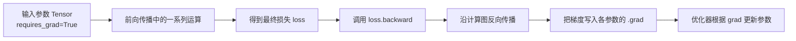

# EP03｜自动求导与反向传播


<p align="center">
 
</p>

<h1 align="center">PyTorch 你不学</h1>
<h2 align="center">EP03 自动求导与反向传播</h2>
<h4 align="center">吴佳浩 · 著</h4>
<h3 align="center">15 篇 · 本地 Windows 实战 · RTX 5090 实测</h3>

<p align="center">
 
 
 
 
 
</p>

<p align="center">
  <b>[Thu 2026-06-11 02:04 GMT+8] 作者：吴佳浩 | 撰稿：2026-05-25 | 实测：RTX 5090 + 96GB + Windows 11</b>
</p>


## 本篇你会学到什么

这一篇承接上一章的 Tensor 基础，开始真正进入“模型为什么能学”的核心机制。学完这一篇，你应该能够：

- 理解 `requires_grad`、计算图、`.grad`、`backward()` 各自是什么意思
- 知道 PyTorch 为什么能“自动算梯度”
- 搞清楚反向传播在训练里到底扮演什么角色
- 看懂为什么参数可以根据损失自动更新
- 能排查梯度为 `None`、梯度累积、反向传播报错等常见问题

---

## 一、为什么要学自动求导

如果说 Tensor 是 PyTorch 的基础语言，那么 **自动求导（autograd）就是 PyTorch 真正能训练神经网络的核心机制**。

因为深度学习训练本质上不是“写一个公式算出结果”这么简单，而是要不断回答这个问题：

> 当前模型做错了多少？如果要让它变得更好，每个参数应该往哪个方向调整？

这个“应该怎么调”的信息，就是通过**梯度**得到的。

假设没有自动求导，你每写一个模型，都得自己手推每一层参数的导数，再自己实现链式法则传播。这在简单模型里还能勉强做到，一旦模型变复杂，几乎无法维护。

PyTorch 的价值之一，就是它会帮你：

- 记录前向传播中做过的运算
- 构建计算图
- 在你调用 `backward()` 时自动沿着图反向计算梯度

所以这一篇本质上是在回答：

> **为什么你写完 loss.backward() 之后，模型就“知道该怎么改参数”了？**

---

## 二、核心理论讲解

### 1. 梯度到底是什么

先别把梯度想得太抽象。

你可以把梯度理解成：

> **某个变量轻微变化时，结果会朝哪个方向变化、变化有多快。**

比如一个最简单的函数：

\[
y = x^2
\]

当 `x = 2` 时，导数是 `2x = 4`。这个 4 表示：

- 如果 `x` 再往前动一点点
- `y` 会以大约 4 倍的速度变化

在深度学习里：

- `x` 往往不是普通变量，而是模型参数
- `y` 往往不是普通函数值，而是损失值 `loss`

于是梯度就变成了：

> **损失函数对每个参数的敏感程度。**

这正是优化器更新参数所需要的信息。

### 2. 什么是自动求导

自动求导不是数值微分，也不是符号求导，而是一种更适合程序执行的求导机制。

PyTorch 在前向传播时，会跟踪这些信息：

- 哪些 Tensor 需要梯度
- 这些 Tensor 做了什么运算
- 运算之间的依赖关系是什么

这些依赖关系连起来，就形成了**计算图**。

当你调用：

```python
loss.backward()
```

PyTorch 就会沿着这张图反向传播，把梯度一步一步传回去，最后把结果存到对应参数的 `.grad` 里。

### 3. 什么是 `requires_grad`

`requires_grad=True` 的意思不是“马上算梯度”，而是：

> 这个 Tensor 后续参与的运算，需要被 autograd 跟踪，以便将来能对它求梯度。

这通常用于：

- 模型参数
- 需要优化的中间变量

如果一个 Tensor 不需要训练，也不参与梯度更新，那么通常没必要开启它。

### 4. 什么是计算图

计算图可以理解成：

> 一张记录“某个结果是如何一步步算出来”的依赖关系图。

比如：

```python
x = torch.tensor(2.0, requires_grad=True)
y = x ** 2 + 3 * x + 1
```

这里 `y` 不是凭空出现的，它依赖于：

- `x ** 2`
- `3 * x`
- 常数 `1`

PyTorch 会把这些依赖记下来。这样在 `y.backward()` 时，它就知道怎么用链式法则把梯度一路传回 `x`。

### 5. `.grad` 保存的是什么

当你对标量 loss 调用 `backward()` 后，PyTorch 会把梯度写到叶子节点 Tensor 的 `.grad` 属性中。

例如：

- `w.grad` 表示损失对参数 `w` 的梯度

这个值不是“参数更新后的结果”，而是“参数应该如何更新的依据”。

真正更新参数的是优化器，比如：

```python
optimizer.step()
```

### 6. 为什么梯度会累积

这是初学者最容易踩的坑之一。

PyTorch 默认不会在每次 `backward()` 后自动清空梯度，而是**累加**到已有的 `.grad` 上。

这意味着：

- 第一次 `backward()` 后，`w.grad = g1`
- 第二次 `backward()` 后，`w.grad = g1 + g2`

这么设计是为了支持一些更灵活的训练技巧，比如梯度累积训练。但对基础训练循环来说，你通常每个 batch 都应该先清空梯度。

---

## 三、先建立一个直觉理解

你可以把反向传播想成“倒着追责”的过程。

前向传播时，模型一步步算出了一个最终结果，比如 `loss = 0.82`。但这个结果不好还不够，你还得知道：

- 到底是哪部分参数导致它不好
- 每个参数各自该改多少

于是反向传播会从最终损失出发，沿着计算图往回走：

1. 先看最终 loss 对上一层输出有多敏感
2. 再看上一层输出对更前面参数有多敏感
3. 一层一层往回传
4. 最后把每个参数的梯度算出来

这就是链式法则在程序里的落地形式。

所以“反向传播”这个词，重点不是“把模型倒过来跑”，而是：

> **从结果往原因回推每一层该承担多少责任。**

---

## 四、真实项目里怎么用

### 场景 1：训练分类模型时更新参数

你写一个分类模型，输入一批样本后得到预测值，和真实标签比较得到损失 `loss`。这时训练最关键的一步就是：

```python
loss.backward()
```

这一步执行后，模型每个参数都会拿到自己的梯度。然后优化器根据这些梯度决定怎么更新参数。

### 场景 2：调试模型为什么不学习

有时候训练时 loss 一直不降，你需要判断问题是不是出在梯度上。这时你经常会检查：

- 某些参数是否 `requires_grad=True`
- 某些参数的 `.grad` 是否一直是 `None`
- 梯度值是否异常大或异常小

也就是说，自动求导不仅服务于训练，也服务于**调试训练失败原因**。

### 场景 3：冻结部分参数做迁移学习

真实项目里经常会这么做：

- 预训练模型前半部分参数冻结
- 只训练最后几层

这时本质上就是通过设置：

```python
param.requires_grad = False
```

来告诉 autograd：

- 这些参数不参与梯度更新
- 后续不用为它们保存梯度

这就是 `requires_grad` 在工程里的典型实际用法。

---

## 五、流程图 / 结构图（Mermaid）

下面这张图展示了自动求导与反向传播的核心流程：



你可以把这张图记成一句话：

> **前向传播负责算结果，反向传播负责算责任，优化器负责执行修改。**

---

## 六、从零写一个最小可运行示例

下面先从一个最简单的一元函数开始。目标不是炫技巧，而是让你真正看到：

- 什么叫 `requires_grad`
- 什么叫 `backward()`
- 什么叫 `.grad`

```python
import torch

# 创建一个标量张量 x，并告诉 PyTorch：
# 后续如果有基于 x 的运算，请帮我跟踪计算图，后面我要对 x 求梯度
x = torch.tensor(2.0, requires_grad=True)

# 构造一个简单函数：y = x^2 + 3x + 1
# 由于 x.requires_grad=True，PyTorch 会跟踪这段运算
# 并在内部记录 y 是如何由 x 计算出来的
y = x ** 2 + 3 * x + 1

print("x =", x)
print("y =", y)

# 对 y 做反向传播
# 因为 y 是一个标量，所以可以直接调用 backward()
# 调用后，PyTorch 会自动计算 dy/dx，并把结果写入 x.grad
y.backward()

# 理论上，y = x^2 + 3x + 1
# 所以 dy/dx = 2x + 3
# 当 x = 2 时，导数应为 7
print("x.grad =", x.grad)
```

---

## 七、再看一个向量参数示例

上面那个例子比较像数学练习。下面这个更接近训练时的真实情况：参数通常不是单个标量，而是一组向量或矩阵。

这段代码演示：

- 一个参数向量 `w`
- 一个简单的损失函数 `loss`
- 如何对整组参数求梯度

```python
import torch

# 定义一个长度为 3 的参数向量
# 在训练里，你可以把它理解成某一层的简化参数表示
w = torch.tensor([1.0, 2.0, 3.0], requires_grad=True)

# 构造一个简单损失函数：所有元素平方后求和
# loss = 1^2 + 2^2 + 3^2 = 14
loss = (w ** 2).sum()

print("w =", w)
print("loss =", loss)

# 对 loss 反向传播
# 这里 loss 是标量，因此仍然可以直接 backward()
loss.backward()

# 理论上：
# d(w_i^2)/d(w_i) = 2 * w_i
# 所以梯度应为 [2, 4, 6]
print("w.grad =", w.grad)
```

这段代码很重要，因为它已经开始接近训练中的真实模式：

- 参数不是单个数，而是一组数
- 损失是由一组参数共同决定的
- 反向传播会给每个参数位置都算出对应梯度

---

## 八、梯度累积为什么重要

下面这段代码专门演示 PyTorch 默认的梯度累积机制。

如果你不理解这点，后面写训练循环时很容易出 bug。

```python
import torch

# 定义一个可求导的标量参数
w = torch.tensor(1.0, requires_grad=True)

for step in range(3):
    # 定义一个简单损失：loss = w^2
    loss = w ** 2

    # 反向传播后，梯度会累加到 w.grad 上
    loss.backward()

    print(f"第 {step + 1} 次 backward 后，w.grad = {w.grad}")

    # 手动清零梯度，避免下一轮继续叠加
    w.grad.zero_()
```

你运行后会发现：

- 如果每轮都清零，那么每次看到的梯度都比较稳定
- 如果把 `w.grad.zero_()` 注释掉，梯度会不断累加

这也是为什么训练循环里几乎总会写：

```python
optimizer.zero_grad()
```

本质上它做的就是“在下一轮计算前把旧梯度清掉”。

---

## 九、把自动求导和训练连接起来

现在我们把这件事和训练循环真正连上。

在训练里，自动求导通常不是单独出现的，而是嵌在下面这个结构里：

```python
import torch
import torch.nn as nn

# 一个极简线性层，模拟模型参数
linear = nn.Linear(3, 1)

# 假设有 1 条输入样本，特征维度为 3
x = torch.tensor([[0.5, 1.0, -1.5]], dtype=torch.float32)

# 假设真实目标值为 1.0
target = torch.tensor([[1.0]], dtype=torch.float32)

# 均方误差损失
criterion = nn.MSELoss()

# 前向传播：模型根据输入得到预测值
pred = linear(x)

# 计算预测值和真实值之间的误差
loss = criterion(pred, target)

print("pred =", pred)
print("loss =", loss)

# 反向传播：为 linear 的权重和偏置计算梯度
loss.backward()

# 查看参数梯度
print("weight.grad =", linear.weight.grad)
print("bias.grad =", linear.bias.grad)
```

这段代码的意义在于：

- `linear.weight` 和 `linear.bias` 本质上都是需要训练的参数 Tensor
- `loss.backward()` 执行后，它们就有了 `.grad`
- 后面优化器就能根据这些梯度进行更新

这就是“训练为什么能自动更新参数”的底层原因。

---

## 十、运行结果应该怎么看

你运行上面的示例时，重点看下面这些现象。

### 1. `x.grad` / `w.grad` 是否符合理论值

比如第一个示例里：

- `y = x^2 + 3x + 1`
- `x = 2`
- 理论导数是 `7`

如果输出的 `x.grad` 接近 7，说明你已经真正看到了自动求导不是“玄学”，而是和数学是一一对应的。

### 2. 向量梯度是否逐元素对应

在 `w = [1, 2, 3]` 的例子里，理论梯度应该是：

- `[2, 4, 6]`

这说明反向传播不是只给一个总梯度，而是会给参数中每个位置都计算对应的梯度。

### 3. 梯度是不是会累积

在梯度累积示例里，重点观察：

- 清零前的梯度是否不断叠加
- 清零后每次是否恢复到“单轮计算”的结果

如果你理解了这个现象，后面就会更容易理解训练循环里为什么一定要写 `zero_grad()`。

### 4. 参数梯度是否不是 `None`

在线性层示例里，重点看：

- `linear.weight.grad`
- `linear.bias.grad`

如果它们不是 `None`，说明：

- 参数参与了计算图
- loss 成功反向传播到了这些参数

这就是训练能成立的关键前提。

---

## 十一、常见错误与排查

### 问题 1：梯度是 `None`

常见原因：

- 参数没有开启 `requires_grad`
- 这个 Tensor 不是叶子节点，却直接去看它的 `.grad`
- 计算图中途被断开了

排查建议：

```python
print(param.requires_grad)
print(param.grad)
```

如果你怀疑图断了，要检查有没有做不合适的 `.detach()`、`.item()` 或转换操作。

### 问题 2：不是标量却直接 `backward()`

很多时候只有标量 loss 才能直接调用：

```python
loss.backward()
```

如果你拿一个非标量 Tensor 直接反向传播，可能会报错，因为 PyTorch 不知道该默认用哪个方向聚合梯度。

入门阶段最简单的原则是：

- 先确保最终反向传播对象是一个标量 loss

### 问题 3：忘记清空梯度

表现通常是：

- 训练能跑
- 但梯度越来越奇怪
- loss 行为不稳定

这类问题很隐蔽，但很常见。

### 问题 4：在不该记录梯度的地方也记录了

比如纯推理阶段，如果你还保留梯度跟踪，会浪费内存和计算。

后面做推理时，通常会配合：

```python
with torch.no_grad():
    ...
```

这和训练阶段是不同的。

### 问题 5：误以为 `backward()` 会自动更新参数

这是概念性误区。

- `backward()` 只负责算梯度
- `optimizer.step()` 才负责真正更新参数

这两步不能混为一谈。

---

## 十二、本篇小结

这一篇最核心的认知有 4 个：

1. **自动求导让 PyTorch 能够自动计算参数梯度**
2. **`requires_grad=True` 决定一个 Tensor 是否参与梯度跟踪**
3. **`loss.backward()` 会沿计算图反向传播，把梯度写到参数的 `.grad` 中**
4. **梯度只是“更新依据”，真正修改参数的是优化器**

如果你把这条链路理解清楚，后面学训练循环、优化器、迁移学习、参数冻结时，就不会只是机械背代码，而是真知道每一步在干什么。

---

## 十三、练习题

### 练习 1：手动验证标量导数
自己写一个函数：

```python
y = x ** 3 + 2 * x
```

令 `x = 2.0`，开启 `requires_grad=True`，运行 `backward()` 后，验证 `x.grad` 是否等于理论导数。

### 练习 2：向量梯度练习
创建：

```python
w = torch.tensor([2.0, -1.0, 0.5], requires_grad=True)
loss = (w ** 2).sum()
```

执行反向传播后，打印 `w.grad`，并手算验证结果是否一致。

### 练习 3：观察梯度累积
把“梯度累积为什么重要”那段代码中的 `w.grad.zero_()` 注释掉，看看打印结果发生了什么变化。

### 练习 4：查看线性层参数梯度
自己写一个 `nn.Linear(4, 2)` 的小例子，输入一个 batch，计算一个简单 loss，然后打印：

- `weight.grad.shape`
- `bias.grad.shape`

观察它们是否和参数本身形状对应。

### 练习 5：思考题
为什么说：

- 前向传播负责“算结果”
- 反向传播负责“算责任”
- 优化器负责“执行修改”

请你试着用自己的话解释这三步的分工。

---

## 下一篇预告

下一篇我们会把“参数为什么能学”继续往前推进一步：**用 `nn.Module` 正式把网络结构搭起来**。

到那时你会看到：

- 层和参数是怎么被组织到一个模型对象里的
- `__init__()` 和 `forward()` 为什么必须分工明确
- 一个最基础的全连接网络是怎么从模块定义走向真正可训练模型的
