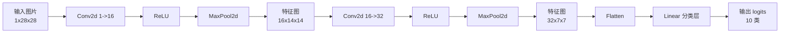

# EP08｜卷积神经网络 CNN 入门


<p align="center">
 
</p>

<h1 align="center">PyTorch 你不学</h1>
<h2 align="center">EP08 卷积神经网络 CNN 入门</h2>
<h4 align="center">吴佳浩 · 著</h4>
<h3 align="center">15 篇 · 本地 Windows 实战 · RTX 5090 实测</h3>

<p align="center">
 
 
 
 
 
</p>

<p align="center">
  <b>[Thu 2026-06-11 02:04 GMT+8] 作者：吴佳浩 | 撰稿：2026-05-25 | 实测：RTX 5090 + 96GB + Windows 11</b>
</p>


## 本篇你会学到什么

这一篇承接 MNIST 全连接分类案例，开始回答一个更关键的问题：为什么图像任务需要更懂空间结构的模型。学完这一篇，你应该能够：

- 理解为什么图像任务通常更适合 CNN，而不是直接用全连接网络
- 知道卷积层、池化层、通道数、特征图分别是什么意思
- 学会使用 `nn.Conv2d`、`nn.MaxPool2d`、`nn.Flatten` 搭建一个最小 CNN
- 能推导图像在 CNN 中经过各层后的 shape 变化
- 理解 CNN 为什么比“直接拍平成向量”的做法更适合提取图像结构信息
- 为后续更真实的图像分类任务打下基础

---

## 一、为什么图片任务常用 CNN

在上一节里，你已经用一个最基础的全连接网络做了 MNIST 分类。那个例子能跑通，但它有一个明显局限：

> **它把图像当成普通向量处理，没有很好地利用图像本身的空间结构。**

例如一张 `28 × 28` 的图片，本来是二维结构：

- 上下位置有关系
- 左右位置有关系
- 邻近像素之间通常更相关

如果你一上来就把它拍平成 `784` 维向量：

- 图像的局部结构信息会被弱化
- 模型不知道哪些像素原本彼此相邻
- 对平移、局部纹理等特征不够敏感

而 CNN（卷积神经网络）的核心思想就是：

> **不要一开始就把整张图压扁，而是先用局部感受野从图片中逐步提取特征。**

这就是为什么 CNN 成为经典图像任务的基础模型。

---

## 二、核心理论讲解

### 1. CNN 在干什么

可以先用一句非常直白的话理解 CNN：

> **CNN 会用一个个小窗口在图片上滑动，先看局部，再把局部特征逐层组合成更抽象的整体特征。**

和全连接网络相比，CNN 的重点不是“每个输入都和下一层每个神经元直接连接”，而是：

- 先在局部区域提特征
- 再逐步扩大感受范围
- 最后做分类判断

### 2. 什么是卷积层 `Conv2d`

卷积层可以理解成一组“特征探测器”。

这些探测器会在图像上滑动，尝试识别某类局部模式，比如：

- 边缘
- 角点
- 纹理
- 局部笔画

在 MNIST 这种数字识别任务里，卷积层很适合提取：

- 横线
- 竖线
- 弯曲笔画
- 局部形状结构

### 3. 什么是通道数

在 `nn.Conv2d(in_channels, out_channels, ...)` 中：

- `in_channels`：输入通道数
- `out_channels`：输出通道数

对灰度图像来说：

- 输入通道通常是 `1`

如果第一层卷积设置 `out_channels=16`，那就表示：

- 这一层会学习 16 组不同的卷积核
- 最终输出 16 张特征图

这些特征图可以理解成：

- 每张都在强调不同类型的局部模式

### 4. 什么是特征图

卷积层输出的结果通常叫**特征图（feature map）**。

它不是原始像素图，而是“经过卷积核提取后的响应图”。

如果某个卷积核特别擅长检测竖线，那么：

- 图片里有明显竖线的位置，响应值可能更高
- 没有该特征的位置，响应值可能更低

所以特征图本质上是在回答：

> **图片中哪里出现了某种模式？**

### 5. 什么是池化层 `MaxPool2d`

池化层的作用可以简单理解为：

- 压缩空间尺寸
- 保留更重要的局部响应
- 降低后续计算量
- 让特征更有一定的平移鲁棒性

最常见的是最大池化 `MaxPool2d`。

例如：

```python
nn.MaxPool2d(2)
```

通常表示用 `2 × 2` 的窗口做下采样，把特征图宽高各缩小一半。

### 6. 为什么 CNN 比直接 Flatten 更适合图像

因为图像不是一堆无序数字，而是有空间结构的数据。

CNN 相比“先拍平再全连接”的优势主要包括：

- 更能利用局部空间关系
- 参数量通常更合理
- 更适合提取层次化视觉特征
- 在图像任务上往往效果更好

这也是为什么你后面接触更复杂图像模型时，几乎都会看到卷积结构或其变体。

---

## 三、先建立一个直觉理解

你可以把 CNN 想成一个“分层看图”的系统。

- 第一层卷积：先识别很基础的局部模式，比如边缘和笔画
- 更深一层：把这些边缘和笔画组合成更复杂的局部结构
- 再往后：逐渐形成对整体数字形状的理解
- 最后分类头根据这些高级特征判断这是几号数字

所以 CNN 不是直接“记住像素值”，而是：

> **逐层把原始图像变成更适合分类的特征表示。**

---

## 四、真实项目里怎么用

### 场景 1：替换掉简单全连接图像模型

如果你在图像分类任务里发现：

- 全连接模型效果一般
- 参数利用不合理
- 对图像空间结构理解不够

第一步很常见的升级就是：

- 把 `Flatten + Linear` 的简单结构
- 换成 `Conv2d + ReLU + Pooling + Classifier`

这就是 CNN 入门最典型的真实用途。

### 场景 2：所有更复杂视觉模型的前置基础

虽然现代视觉任务里你还会接触：

- ResNet
- EfficientNet
- UNet
- Vision Transformer

但在学习路径上，CNN 是非常重要的台阶。因为它帮你建立了：

- 通道数概念
- 特征图概念
- 图像 shape 流动意识
- 卷积与池化如何改变空间尺寸的理解

这些能力在后面都会继续用到。

---

## 五、流程图 / 结构图（Mermaid）

下面这张图展示了一个最小 CNN 在 MNIST 图片上的数据流：



这张图里最值得你盯住的是 shape 的变化，因为 CNN 初学最容易错的就是维度推导。

---

## 六、从零写一个最小可运行示例

下面我们写一个最基础的 CNN 模型，用来替换前一节里的全连接 MNIST 模型。

这个模型的目标很明确：

- 输入：MNIST 灰度图 `(1, 28, 28)`
- 输出：10 个类别的 logits

```python
import torch
import torch.nn as nn


class SmallCNN(nn.Module):
    """
    一个最小可运行的 CNN，用于 MNIST 10 分类。

    输入：
        shape = (batch_size, 1, 28, 28)

    输出：
        shape = (batch_size, 10)
    """
    def __init__(self):
        super().__init__()

        # 特征提取部分
        self.features = nn.Sequential(
            # 第一层卷积：
            # 输入通道 = 1（灰度图）
            # 输出通道 = 16（学习 16 组局部特征）
            # kernel_size=3 表示使用 3x3 卷积核
            # padding=1 可以让卷积后宽高保持不变
            nn.Conv2d(1, 16, kernel_size=3, padding=1),
            nn.ReLU(),

            # 最大池化：把空间尺寸缩小一半
            # 28x28 -> 14x14
            nn.MaxPool2d(2),

            # 第二层卷积：
            # 输入通道从 16 变为输出通道 32
            nn.Conv2d(16, 32, kernel_size=3, padding=1),
            nn.ReLU(),

            # 再做一次池化：14x14 -> 7x7
            nn.MaxPool2d(2)
        )

        # 分类头部分
        self.classifier = nn.Sequential(
            # 把 32x7x7 的特征图展平成一维向量
            nn.Flatten(),

            # 最终线性分类层
            # 输入维度 = 32 * 7 * 7
            # 输出维度 = 10，对应 10 个数字类别
            nn.Linear(32 * 7 * 7, 10)
        )

    def forward(self, x):
        # 先做特征提取
        x = self.features(x)

        # 再进入分类头得到最终 logits
        x = self.classifier(x)
        return x


# 构造模型并打印结构
model = SmallCNN()
print(model)

# 构造一批假的 MNIST 图像
# batch_size = 8，通道数 = 1，尺寸 = 28x28
x = torch.randn(8, 1, 28, 28)

# 前向传播
out = model(x)

print("输入 x.shape =", x.shape)
print("输出 out.shape =", out.shape)
```

---

## 七、一步一步推导 shape 变化

CNN 初学时，最重要的能力之一就是**手动推导 shape**。下面把这个过程拆开看。

### 输入

输入是一张 MNIST 图片：

- `(1, 28, 28)`

如果 batch size 是 8，则：

- `(8, 1, 28, 28)`

### 第一层卷积

```python
nn.Conv2d(1, 16, kernel_size=3, padding=1)
```

含义是：

- 输入通道数：1
- 输出通道数：16
- 卷积核大小：3×3
- `padding=1` 保证卷积前后宽高不变

所以输出 shape 变成：

- `(8, 16, 28, 28)`

### 第一次池化

```python
nn.MaxPool2d(2)
```

池化会把宽高减半：

- `28 × 28 -> 14 × 14`

所以输出变成：

- `(8, 16, 14, 14)`

### 第二层卷积

```python
nn.Conv2d(16, 32, kernel_size=3, padding=1)
```

宽高保持不变，但通道数从 16 变成 32：

- `(8, 32, 14, 14)`

### 第二次池化

宽高再次减半：

- `14 × 14 -> 7 × 7`

所以输出变成：

- `(8, 32, 7, 7)`

### Flatten 后

每条样本展平成：

- `32 × 7 × 7 = 1568`

所以 batch 形式为：

- `(8, 1568)`

### 最终线性层输出

最后分类层输出 10 类 logits：

- `(8, 10)`

这就是为什么线性层输入维度要写成：

```python
nn.Linear(32 * 7 * 7, 10)
```

---

## 八、把 CNN 接入 MNIST 训练流程

下面给出一个更接近真实使用的 CNN + MNIST 训练示例。

```python
import torch
import torch.nn as nn
from torch.utils.data import DataLoader
from torchvision import datasets, transforms


device = "cuda" if torch.cuda.is_available() else "cpu"

transform = transforms.ToTensor()
train_dataset = datasets.MNIST(root="./data", train=True, download=True, transform=transform)
test_dataset = datasets.MNIST(root="./data", train=False, download=True, transform=transform)

train_loader = DataLoader(train_dataset, batch_size=64, shuffle=True, num_workers=0)
test_loader = DataLoader(test_dataset, batch_size=64, shuffle=False, num_workers=0)


class SmallCNN(nn.Module):
    def __init__(self):
        super().__init__()
        self.features = nn.Sequential(
            nn.Conv2d(1, 16, kernel_size=3, padding=1),
            nn.ReLU(),
            nn.MaxPool2d(2),
            nn.Conv2d(16, 32, kernel_size=3, padding=1),
            nn.ReLU(),
            nn.MaxPool2d(2)
        )
        self.classifier = nn.Sequential(
            nn.Flatten(),
            nn.Linear(32 * 7 * 7, 10)
        )

    def forward(self, x):
        x = self.features(x)
        x = self.classifier(x)
        return x


model = SmallCNN().to(device)
criterion = nn.CrossEntropyLoss()
optimizer = torch.optim.Adam(model.parameters(), lr=1e-3)

for epoch in range(3):
    model.train()
    total_loss = 0.0

    for batch_idx, (images, labels) in enumerate(train_loader):
        images = images.to(device)
        labels = labels.to(device)

        optimizer.zero_grad()
        logits = model(images)
        loss = criterion(logits, labels)
        loss.backward()
        optimizer.step()

        total_loss += loss.item()

        if batch_idx < 2:
            print(
                f"[epoch {epoch+1} | batch {batch_idx+1}] "
                f"images.shape={images.shape}, logits.shape={logits.shape}, loss={loss.item():.4f}"
            )

    print(f"epoch={epoch+1}, avg_loss={total_loss / len(train_loader):.4f}")
```

---

## 九、运行结果应该怎么看

运行上面的代码时，重点看以下几个部分。

### 1. 输入 shape 是否仍然是图像格式

应该看到：

- `images.shape = (64, 1, 28, 28)`

说明你没有错误地提前把图像拍平。

### 2. 输出 logits 是否是 `(batch_size, 10)`

如果输出不是 10 类，那么最后分类层就和任务不匹配。

### 3. loss 是否能正常下降

CNN 在 MNIST 上通常是比较容易训练的，如果训练流程没问题，loss 往往会比较明显下降。

### 4. 如果报线性层维度错误，优先怀疑 shape 推导

这是 CNN 初学最常见的问题，不一定是模型“思想”错了，而是：

- `Flatten` 前的 shape 没算准
- `Linear` 输入维度写错了

---

## 十、常见错误与排查

### 问题 1：`Linear` 输入维度写错

这是最常见错误之一。

例如你明明经过两次池化后已经是 `32 x 7 x 7`，却把线性层写成了别的维度，就会报错。

解决思路：

- 先手动推导 shape
- 或在 `forward()` 中临时打印中间张量 shape

### 问题 2：误把 `Conv2d` 的通道数当成图片宽高

`Conv2d(1, 16, ...)` 里的 1 和 16 表示通道数，不是图片尺寸。

这点一开始很容易混。

### 问题 3：输入给 CNN 的 Tensor 维度不对

CNN 常见输入格式是：

- `(batch_size, channels, height, width)`

如果你给成了别的顺序，模型可能直接报错。

### 问题 4：一上来就把图像 Flatten 了

如果你使用 CNN，就不要在进入卷积层前先把图像拍平，否则卷积层就失去意义了。

### 问题 5：只记模型代码，不理解 shape 流动

CNN 初学最危险的不是代码写不出来，而是“复制能跑，但不知道为什么能跑”。

真正关键的是：

- 每层输入输出 shape 是什么
- 池化怎么改变尺寸
- 最终为什么能接到分类层

---

## 十一、本篇小结

这一篇最关键的认知有几个：

- CNN 更适合处理图像这种具有空间结构的数据
- 卷积层负责提取局部特征，池化层负责压缩空间尺寸
- 通道数表示“学到多少种特征响应图”
- CNN 入门最容易错的是 shape 推导，而不是 API 本身
- 用 CNN 替换简单全连接模型，是图像任务里非常自然的一步升级

你只要把这一篇吃透，后面再看更复杂的视觉模型，就不会觉得完全陌生。

---

## 十二、练习题

### 练习 1：修改第一层通道数
把第一层卷积输出通道从 `16` 改成 `8`，观察模型结构和后续 shape 有什么变化。

### 练习 2：再加一层卷积
尝试在第二层卷积后再加一层卷积和池化，然后手动推导最终特征图尺寸。

### 练习 3：打印中间 shape
在 `forward()` 中临时打印：

- 卷积后 shape
- 池化后 shape
- Flatten 后 shape

帮助自己真正理解维度流动。

### 练习 4：把 CNN 接到 MNIST 训练里
用这篇的 `SmallCNN` 替换前一篇的全连接模型，看看训练 loss 是否正常。

### 练习 5：思考题
为什么说 CNN 相比“先 Flatten 再全连接”的做法，更能利用图像的空间结构？

试着用自己的话解释一下。

---

## 下一篇预告

下一篇我们会开始从“能训练”进一步走向“能判断训练是否靠谱”，进入 **验证集、指标与过拟合处理**。

你会看到：

- 为什么不能只盯着训练集 loss
- accuracy、验证集、过拟合这些概念在实战里为什么必须尽早建立
- 模型不仅要会学，还要学得可判断、可监控
