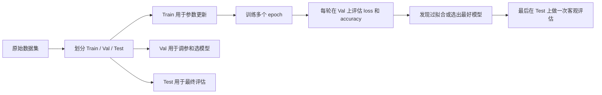

# EP09｜验证集、指标与过拟合处理


<p align="center">
 
</p>

<h1 align="center">PyTorch 你不学</h1>
<h2 align="center">EP09 验证集、指标与过拟合处理</h2>
<h4 align="center">吴佳浩 · 著</h4>
<h3 align="center">15 篇 · 本地 Windows 实战 · RTX 5090 实测</h3>

<p align="center">
 
 
 
 
 
</p>

<p align="center">
  <b>[Thu 2026-06-11 02:04 GMT+8] 作者：吴佳浩 | 撰稿：2026-05-25 | 实测：RTX 5090 + 96GB + Windows 11</b>
</p>


## 本篇你会学到什么

这一篇承接 CNN 与分类实战，开始把“能训练”升级成“会判断训练质量”。学完这一篇，你应该能够：

- 区分训练集、验证集、测试集的职责
- 理解为什么不能只看训练集表现
- 学会在 PyTorch 中计算分类准确率等基础指标
- 知道如何从 loss 和 accuracy 的变化中识别过拟合
- 了解数据增强、正则化、权重衰减、早停等常见处理方法
- 把“训练一个模型”和“选一个真正泛化好的模型”区分开来

---

## 一、为什么学到这里必须开始关心验证集和过拟合

很多初学者做到前面几步时，会有一种错觉：

- 模型能训练
- loss 在降
- 看起来就说明模型学得不错

但这其实只说明了一件事：

> **模型在训练集上正在拟合。**

它并不能自动说明模型对“没见过的新数据”也表现好。

而机器学习最重要的目标，从来不是“把训练集背下来”，而是：

> **学到能泛化到新样本的规律。**

这就是为什么一旦开始做真正像样的任务，你就必须引入：

- 验证集
- 评估指标
- 过拟合判断

否则你训练出来的模型很可能只是“在训练数据上看起来很强”，一上线就掉链子。

---

## 二、核心理论讲解

### 1. 训练集、验证集、测试集分别干什么

这是机器学习最基本但也最容易被学成口号的概念。真正的问题不是“背出三者定义”，而是你要知道：

- 哪一份数据会参与参数更新
- 哪一份数据用来帮你做模型选择
- 哪一份数据应该留到最后再看

只有把这三者的角色分清楚，你后面看到的 loss、accuracy、最佳模型保存逻辑，才不会混成一团。

#### 训练集（train set）

训练集用于：

- 前向传播
- 计算 loss
- 反向传播
- 更新模型参数

也就是说，训练集是模型真正“学习”的数据来源。

#### 验证集（validation set）

验证集用于：

- 观察模型泛化表现
- 调整超参数
- 选择更好的模型版本
- 判断是否发生过拟合

注意：

- 验证集通常**不参与参数更新**
- 它更像是一个“开发阶段的模拟考试”

#### 测试集（test set）

测试集用于：

- 在模型和超参数基本确定后，做最终一次客观评估

测试集更像“正式考试”。

理想情况下，你不应该反复根据测试集结果来调模型，否则测试集也会逐渐失去客观性。

### 2. 为什么不能只看训练集表现

因为模型完全可能做到：

- 训练集上 loss 很低
- 训练准确率很高
- 但验证集表现一般甚至变差

这就是典型的过拟合信号。

只看训练集，就像只看自己练习过的题目成绩；它不能证明你真的掌握了通用规律。

### 3. 什么是过拟合

过拟合（overfitting）可以简单理解成：

> **模型对训练集记得太细了，以至于对新数据反而表现不好。**

它不是“模型学得太好”，而是“学偏了”。

更准确地说，模型学到的不只是通用规律，还把很多：

- 噪声
- 偶然模式
- 训练集特有细节

也一起记住了。

### 4. 什么是准确率 Accuracy

对分类任务来说，最常见的基础指标就是准确率：

\[
Accuracy = \frac{预测正确的样本数}{总样本数}
\]

它的优点是：

- 直观
- 简单
- 容易解释

但也要注意：

- 当类别分布极不均衡时，只看 accuracy 可能不够

不过在入门阶段，准确率是非常合适的第一指标。

### 5. 为什么要同时看 loss 和 accuracy

很多人只盯 accuracy，这不够。

因为：

- loss 更细腻，能反映模型输出置信程度的变化
- accuracy 更直观，能反映分类正确与否

这两个指标结合起来看，通常能更好判断训练状态。

例如：

- 训练 loss 持续下降，验证 loss 却上升：可能在过拟合
- 训练 accuracy 很高，验证 accuracy 停滞：也可能在过拟合

---

## 三、先建立一个直觉理解

你可以把这三类数据集理解成三种考试场景。

- **训练集**：平时练习题，可以边做边改答案
- **验证集**：模拟考试，用来判断你现在水平如何、要不要调整学习策略
- **测试集**：正式考试，最后一次客观检验

如果你一直只看训练集，就很像：

- 反复做同一套练习题
- 觉得自己已经全会了
- 但一换题就不会

这正是过拟合的直觉版本。

---

## 四、真实项目里怎么用

### 场景 1：训练过程中每个 epoch 做验证

真实项目里最常见的做法是：

- 每个 epoch 用训练集更新参数
- 每个 epoch 结束后，用验证集评估 loss 和 accuracy

这样你能看到：

- 模型是否持续进步
- 哪一轮开始出现过拟合
- 哪个 epoch 的模型最值得保存

### 场景 2：用验证集选超参数

例如你在调：

- 学习率
- batch size
- Dropout 比例
- weight decay
- 模型深度

真正判断谁更好的，不应该是训练集结果，而应优先参考验证集表现。

### 场景 3：部署前用测试集做最终确认

当你已经选定模型结构和超参数后，再用测试集做一次最终评估。这一步更像是给部署前一个更客观的信心判断。

---

## 五、流程图 / 结构图（Mermaid）

下面这张图展示了训练、验证、测试在项目中的分工：



这张图的重点是：

- 训练集不是万能裁判
- 模型选择和最终评估要分开

---

## 六、先看一个最基础的验证准确率计算

下面这段代码演示如何在验证集上计算分类准确率。

这段逻辑以后几乎会成为你每个分类项目里的固定模板。

```python
correct = 0
total = 0

# 切换到评估模式
# 如果模型中有 Dropout / BatchNorm，这一步尤其重要
model.eval()

# 验证阶段不需要梯度计算，可以节省内存和时间
with torch.no_grad():
    for x, y in val_loader:
        # 把输入和标签迁移到统一设备
        x = x.to(device)
        y = y.to(device)

        # 前向传播得到类别打分
        logits = model(x)

        # 取每条样本得分最高的类别作为预测结果
        preds = torch.argmax(logits, dim=1)

        # 统计预测正确的样本数
        correct += (preds == y).sum().item()

        # 统计总样本数
        total += y.size(0)

# 准确率 = 正确数 / 总数
acc = correct / total
print("val_acc =", acc)
```

---

## 七、写一个更完整的训练 + 验证模板

下面这段代码展示一个更接近真实项目的结构：

- 训练一个 epoch
- 在验证集上评估 loss 和 accuracy
- 每轮都打印结果，帮助你判断是否过拟合

```python
import torch
import torch.nn as nn


def train_one_epoch(model, train_loader, criterion, optimizer, device):
    """
    训练一个 epoch，返回平均训练 loss。
    """
    model.train()
    total_loss = 0.0

    for x, y in train_loader:
        x = x.to(device)
        y = y.to(device)

        optimizer.zero_grad()
        logits = model(x)
        loss = criterion(logits, y)
        loss.backward()
        optimizer.step()

        total_loss += loss.item()

    return total_loss / len(train_loader)


@torch.no_grad()
def evaluate(model, data_loader, criterion, device):
    """
    在验证集或测试集上评估平均 loss 和 accuracy。
    """
    model.eval()
    total_loss = 0.0
    correct = 0
    total = 0

    for x, y in data_loader:
        x = x.to(device)
        y = y.to(device)

        logits = model(x)
        loss = criterion(logits, y)

        total_loss += loss.item()

        preds = torch.argmax(logits, dim=1)
        correct += (preds == y).sum().item()
        total += y.size(0)

    avg_loss = total_loss / len(data_loader)
    acc = correct / total
    return avg_loss, acc


# 假设这些对象你已经准备好了：
# model, train_loader, val_loader, criterion, optimizer, device
for epoch in range(10):
    train_loss = train_one_epoch(model, train_loader, criterion, optimizer, device)
    val_loss, val_acc = evaluate(model, val_loader, criterion, device)

    print(
        f"epoch={epoch+1}, "
        f"train_loss={train_loss:.4f}, "
        f"val_loss={val_loss:.4f}, "
        f"val_acc={val_acc:.4f}"
    )
```

这段代码虽然不长，但非常实用。因为它已经体现了真实训练流程中的一个重要原则：

> **训练和评估要明确分离。**

---

## 八、如何从现象判断是否过拟合

过拟合不是一句口号，而是可以从训练曲线里观察出来的。

### 典型表现 1：训练 loss 持续下降，验证 loss 先降后升

这是最经典的过拟合信号。

说明：

- 模型在训练集上越来越会“记”
- 但在验证集上开始失去泛化能力

### 典型表现 2：训练准确率越来越高，验证准确率停滞甚至下降

这说明模型在训练集上表现越来越强，但这种提升没有转化为对新数据的更好表现。

### 典型表现 3：训练和验证指标差距越来越大

例如：

- train_acc = 0.99
- val_acc = 0.86

这种差距过大时，通常要警惕过拟合。

---

## 九、常见处理办法及其原理

### 1. 加更多数据

这是最根本但也最昂贵的方法。

更多数据通常意味着：

- 更丰富的分布
- 更少的偶然模式被模型过度记住

### 2. 数据增强（Data Augmentation）

在图像任务里非常常见，例如：

- 随机裁剪
- 随机翻转
- 轻微旋转

它的作用不是“凭空创造新知识”，而是增加训练样本多样性，降低模型死记细节的风险。

### 3. Dropout

Dropout 会在训练时随机丢掉一部分神经元输出，从而减少模型对某些固定局部模式的过度依赖。

它是一种经典正则化方法。

### 4. 权重衰减（Weight Decay）

在优化器中常见写法：

```python
optimizer = torch.optim.Adam(model.parameters(), lr=1e-3, weight_decay=1e-4)
```

它的作用可以粗略理解成：

- 抑制参数无限制变大
- 提高模型的泛化稳定性

### 5. 早停（Early Stopping）

如果你发现：

- 验证集表现已经不再改善
- 甚至开始变差

那就没必要继续训练太久。提前停止训练，往往能保住更好的泛化模型。

---

## 十、一个简化的早停思路示例

下面给一个非常简化的“基于验证集 loss 的早停思路”。

```python
best_val_loss = float("inf")
patience = 3
bad_epochs = 0

for epoch in range(20):
    train_loss = train_one_epoch(model, train_loader, criterion, optimizer, device)
    val_loss, val_acc = evaluate(model, val_loader, criterion, device)

    print(
        f"epoch={epoch+1}, train_loss={train_loss:.4f}, "
        f"val_loss={val_loss:.4f}, val_acc={val_acc:.4f}"
    )

    # 如果验证 loss 变好了，就刷新最佳记录
    if val_loss < best_val_loss:
        best_val_loss = val_loss
        bad_epochs = 0

        # 真实项目里这里常会顺手保存当前最佳模型
        # torch.save(model.state_dict(), "best_model.pt")
    else:
        # 如果验证 loss 没变好，就累计一次“坏 epoch”
        bad_epochs += 1

    # 连续若干轮都没改善，则提前停止
    if bad_epochs >= patience:
        print("验证集表现连续未改善，触发早停。")
        break
```

这段代码不是完整框架，但足够让你理解早停的基本思想。

---

## 十一、运行结果应该怎么看

在训练 + 验证过程中，建议你每轮至少记录：

- `train_loss`
- `val_loss`
- `val_acc`

重点关注以下关系。

### 理想状态

- `train_loss` 下降
- `val_loss` 也下降
- `val_acc` 上升

这说明模型不仅在学，而且泛化也在改善。

### 疑似过拟合状态

- `train_loss` 继续下降
- `val_loss` 不降反升
- `val_acc` 停滞或下降

这时通常说明继续训练未必是好事。

### 指标都不好

如果训练和验证都很差，问题可能不是过拟合，而是：

- 模型太弱
- 学习率不合适
- 数据预处理有问题
- 任务本身更复杂

所以不要把所有问题都归为过拟合。

---

## 十二、常见错误与排查

### 问题 1：把验证集也拿去更新参数

这会让验证集失去“模拟考试”的意义。

验证阶段应该：

- `model.eval()`
- `torch.no_grad()`
- 不做 `backward()`
- 不做 `optimizer.step()`

### 问题 2：只看训练 loss，不看验证表现

这是最常见的认知误区之一。

如果只看训练指标，很容易误判模型已经很好。

### 问题 3：反复根据测试集调参

如果你总是看测试集结果来决定：

- 学习率怎么调
- 模型怎么改
- 哪个 epoch 最好

那测试集就不再是“真正独立的最终评估”。

### 问题 4：只看 accuracy，不看 loss

accuracy 虽然直观，但有时候变化比较粗糙。loss 往往能更早反映模型状态变化。

### 问题 5：把“训练差距大”机械理解成一定过拟合

有时验证集差，也可能是：

- 数据分布不一致
- 验证集太小
- 标签质量有问题
- 指标本身不适合任务

所以判断要结合具体场景，不要机械套结论。

---

## 十三、本篇小结

这一篇最重要的认知是：

- 训练集负责更新参数
- 验证集负责调参与选模型
- 测试集负责最终客观评估
- 不能只看训练表现判断模型好坏
- 过拟合的本质是“训练集学得太细，泛化变差”
- 识别过拟合要结合 `train_loss`、`val_loss`、`val_acc` 一起看

如果你把这一篇真正理解透，后面训练模型时就不会只是“把 loss 跑下来”，而会更像一个真正会评估模型质量的人。

---

## 十四、练习题

### 练习 1：给现有训练脚本加验证阶段
在你前面的 MNIST 或 CNN 训练代码中，加入验证阶段，每轮打印：

- `train_loss`
- `val_loss`
- `val_acc`

### 练习 2：观察过拟合趋势
尝试把模型训练更多 epoch，观察是否会出现：

- 训练集继续变好
- 验证集不再改善

的现象。

### 练习 3：加入 weight decay
尝试把优化器改成：

```python
torch.optim.Adam(model.parameters(), lr=1e-3, weight_decay=1e-4)
```

对比加入前后的验证表现。

### 练习 4：实现一个简单早停
参考本篇代码，给训练脚本加上“连续 3 轮验证 loss 不改善就停止”的逻辑。

### 练习 5：思考题
为什么说：

- 训练集像练习题
- 验证集像模拟考试
- 测试集像正式考试

这个类比能帮助你理解模型评估流程？

---

## 一个很实用的训练习惯建议

从这一篇开始，我很建议你以后训练模型时固定保留一份最小训练日志，至少记录：

- 当前 epoch
- train_loss
- val_loss
- val_acc
- 是否刷新了 best model

哪怕你先不用 TensorBoard，也先把这几个数字稳定打印出来。因为很多“训练好像有问题”的判断，最终都不是靠感觉，而是靠这几项最基础的轨迹对比。

---

## 下一篇预告

下一篇我们会进入一个非常工程化、也非常实用的主题：**模型保存、加载与断点续训**。

你会看到：

- 为什么训练好的模型不能只停留在当前进程内存里
- 推理保存和训练现场保存到底差在哪
- 一个训练脚本怎样从“能跑”进一步变成“能恢复、能复现、能持续迭代”
